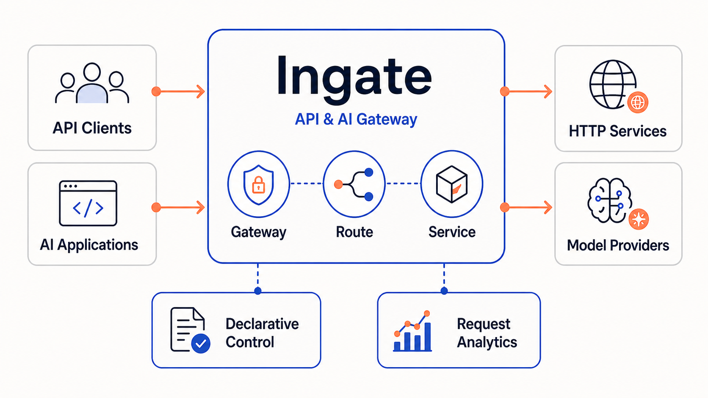
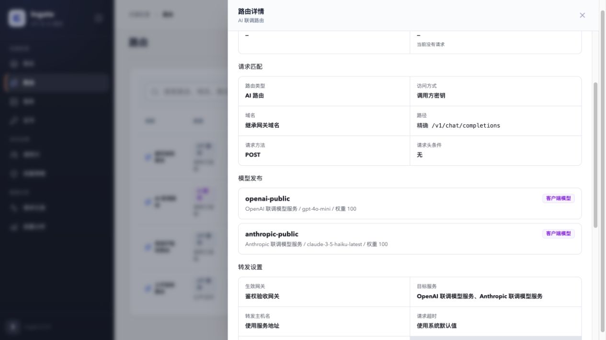
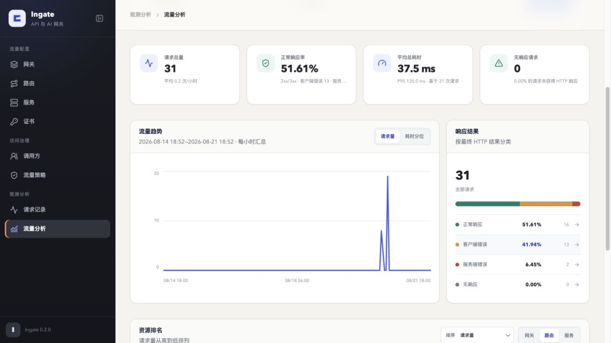

<div align="center">

# Ingate

**基于 Envoy 的声明式 API 与 AI 网关**

Ingate 取意于 **in + gate**：让进入系统的 API 与 AI 流量经过同一个可治理入口。

[](https://go.dev/)
[](https://www.envoyproxy.io/)

</div>



## Ingate 是什么

Ingate 是一个使用官方 Envoy 作为唯一数据平面的网关控制面。它通过自有声明式 API 管理 Gateway、Route、Service、证书和治理策略，将完整配置编译为 Envoy xDS，并把配置状态和流量结果反馈到控制台。

普通 HTTP 服务和模型服务共享同一条产品路径：

**Gateway → Route → Service**

- Gateway 定义流量从哪里进入，例如监听端口、域名和 TLS 证书
- Route 定义请求如何匹配、由谁访问以及转发到哪个 Service
- Service 定义实际连接的 HTTP 服务或模型厂商，包括端点、TLS、负载均衡、健康检查和模型凭据

AI Route 在这条路径上发布稳定的客户端模型名，并把它映射到一个或多个模型 Service。调用方始终使用统一的 OpenAI Chat Completions 请求格式，不需要感知后端实际使用 OpenAI 兼容协议还是 Anthropic Messages 协议。

Ingate 不要求运行在 Kubernetes 中，不维护 Envoy 私有分支，也不建立面向其他数据平面的通用适配层。一套 Ingate 表示一个环境和一个配置域，可以包含多个逻辑 Gateway；需要隔离生产、测试或租户时，应分别部署多套 Ingate。

## 核心能力

| 领域 | 当前能力 |
| --- | --- |
| API 流量 | HTTP/HTTPS Listener、Host/路径/方法/Header 匹配、加权转发、Host 重写、Header 修改、超时与重试 |
| Service 连接 | 多端点、Round Robin/Least Request、主动健康检查、上游 HTTPS 和证书校验 |
| AI 流量 | 对外模型名、加权模型线路、OpenAI Chat Completions、Anthropic Messages 转换、流式响应转换 |
| 访问治理 | 公开或调用方访问模式、访问密钥、Route 授权、IP 允许列表和拒绝列表 |
| 声明式控制 | 资源 CRUD、List/Watch、乐观并发版本、Status、完整配置编译和 xDS 下发 |
| 观测分析 | 请求元数据、转发结果、模型线路尝试、Token 用量、流量趋势和资源排行 |

## 产品预览

### AI 模型发布

AI Route 使用稳定的客户端模型名连接不同协议的模型 Service，调用方不需要感知实际厂商、凭据和真实模型名。



### 流量观测

请求记录异步进入分析链路，Console 统一展示请求量、正常响应率、耗时趋势、响应分布和资源排名。



## 快速开始

### 使用 Docker Compose 安装

安装机只需要 Docker Engine 和 Docker Compose v2，不需要 Go、Node.js 或源码：

```bash
curl -fsSL https://raw.githubusercontent.com/lgc202/ingate/main/scripts/install.sh | bash
```

安装器会下载最新的正式 Release、校验 SHA-256、启动完整环境，然后输出 Console、Gateway 和日常管理命令。默认安装到当前目录的 `ingate` 子目录，也可以安装固定版本：

```bash
curl -fsSLO https://raw.githubusercontent.com/lgc202/ingate/main/scripts/install.sh
bash install.sh ./ingate --version v0.1.0
```

Console 当前没有登录认证，安装版默认只绑定 `127.0.0.1`。完整的配置、启停、日志和数据清理说明见 [Docker Compose 安装说明](deploy/compose/README.md)。

### 从源码启动开发环境

源码开发需要 Go 1.26、Node.js 24、npm 11、Docker Engine 和 Docker Compose v2：

```bash
git clone https://github.com/lgc202/ingate.git
cd ingate

make check-tools
make docker-up
make docker-ps
```

`make docker-up` 会构建 Go 组件、Console 静态资源和本地开发镜像。无论使用安装版还是开发环境，组件就绪后都可以访问：

- Console：<http://127.0.0.1:8001>
- HTTP Gateway：<http://127.0.0.1:8080>
- HTTPS Gateway：<https://127.0.0.1:8443>

HTTP/HTTPS 端口由开发环境预留，创建并成功发布对应 Gateway 后才会承载业务流量。

### 完成一次 API 转发

在 Console 中依次创建：

1. 一个 HTTP Service，端点地址填写 `httpbin.org`，端口填写 `80`
2. 一个 HTTP Gateway，监听 `8080`，域名留空
3. 一个 API Route，路径前缀填写 `/`，目标选择刚创建的 Service，转发主机名选择“使用服务地址”

然后发送请求：

```bash
curl -i http://127.0.0.1:8080/get
```

请求完成后，可以在 Console 的“请求记录”和“流量分析”中查看匹配结果、最终 Service、响应状态和耗时。请求记录通过 ALS、Kafka 和 ClickHouse 异步入库，页面出现结果可能有短暂延迟。

### 调用模型 Route

创建模型 Service 和 AI Route 后，客户端仍使用 OpenAI Chat Completions 格式。下面假设 Route 发布的模型名为 `qwen-max`，并且已经为受保护的 Route 签发调用方密钥：

```bash
curl http://127.0.0.1:8080/v1/chat/completions \
  -H 'Content-Type: application/json' \
  -H 'Authorization: Bearer <access-key>' \
  -d '{
    "model": "qwen-max",
    "messages": [
      {"role": "user", "content": "你是谁"}
    ],
    "stream": false
  }'
```

公开 Route 不需要 `Authorization` Header。客户端提交的模型名在 AI Route 中配置；模型厂商、API Key 和真实模型名分别由模型 Service 与 AI Route 的目标线路管理。

停止安装版会保留所有数据：

```bash
./ingate/bin/stop.sh
```

源码开发环境使用：

```bash
make docker-down
```

## 架构

Ingate 把配置管理、同步流量处理和异步观测拆成三条边界清晰的链路：

1. **控制链路**：Console 通过 Admin API 管理资源；API Server 是 etcd 的唯一访问者；Controller Watch 资源、编译完整 Envoy 配置并通过 xDS 下发
2. **流量链路**：客户端只访问 Envoy；普通 API 直接转发到 HTTP Service，受保护 Route 通过 Authorization 校验，AI Route 通过 AI Processing 完成模型选择和协议转换
3. **观测链路**：Envoy 通过 ALS 异步上报请求元数据；Kafka 解耦采集与分析；Analytics 写入 ClickHouse 并向 Admin API 提供查询

| 组件 | 职责 |
| --- | --- |
| `ingate-console` | 托管控制台静态资源，并把管理请求反向代理到 Admin API |
| `ingate-admin-api` | 面向 Console 的产品 API，负责请求校验、业务规则和协议转换 |
| `ingate-apiserver` | 提供声明式资源 CRUD、List/Watch、版本和 Status，是 etcd 的唯一访问者 |
| `ingate-controller` | Watch 资源、编译 Envoy 配置、切换有效配置、提供 xDS 并回写 Status |
| `Envoy` | 唯一数据平面，接收客户端请求并执行路由、治理和上游转发 |
| `ingate-authz` | 校验调用方访问密钥和 Route 授权，只参与需要调用方认证的请求 |
| `ingate-ai-extproc` | 处理 AI Route 的模型选择、凭据注入、请求与响应协议转换 |
| `ingate-als` | 接收 Envoy ALS 请求记录，通过本地 WAL 保护待投递数据并写入 Kafka |
| `ingate-analytics` | 消费请求记录、写入 ClickHouse，并提供请求明细和流量分析查询 |
| `etcd` | 持久化声明式资源 |
| `Kafka` | 在请求采集与分析之间提供可靠消息链路 |
| `ClickHouse` | 保存请求明细、模型调用记录和流量分析数据 |

Controller、Envoy 与 AI ExtProc 在开发 Compose 中共享网络命名空间，xDS 和 AI Processing 连接只监听 loopback；Authorization 和 ALS 使用 Compose 内部网络，不向宿主机暴露端口。该拓扑只属于本地联调方式，业务组件本身不依赖 Docker Compose 或 Kubernetes。

更详细的组件边界见 [架构说明](docs/architecture.md)。声明式资源协议见 [资源文档](docs/resources)。

## 资源与产品术语

Console 面向用户统一使用 **Service**。当前声明式 API 中对应的底层资源名仍为 `Upstream`，用于表达端点、TLS、负载均衡和健康检查等连接信息。两者指向同一个对象，不存在平行的 Service 与 Upstream 配置体系。

当前声明式资源包括：

- `Gateway`：监听入口、协议、域名和 TLS 证书引用
- `Route`：API/AI 请求匹配、访问模式和 Service 目标
- `Upstream`：HTTP 或模型 Service 的连接配置
- `Certificate`：可复用的 TLS 证书和私钥
- `Caller`：调用方、访问密钥与 Route 授权
- `IPRestrictionPolicy`：Gateway 或 Route 的 IP 访问限制
- `RateLimitPolicy`：Gateway 或 Route 的限流声明

声明式 API 使用 `metadata.name` 作为不可变资源 ID，使用 `spec.displayName` 保存用户可编辑名称。Admin API 向 Console 提供平铺的产品协议，不直接暴露 `metadata/spec/status` 结构。

## 当前边界

- `IPRestrictionPolicy` 已由 Envoy 原生 RBAC 执行
- `RateLimitPolicy` 当前只提供资源协议和管理能力，尚未生成数据面限流配置
- Redis 作为后续治理能力的系统依赖保留，当前不参与流量执行
- 请求记录只持久化排障和分析所需的元数据，不保存请求 Header、查询参数或正文
- MCP 网关和 Agent 编排尚未进入当前运行链路
- `web/prototype` 只使用 Mock 数据验证产品设计；正式 Console 位于 `web/console`，两者不共享业务代码或运行数据

## 开发

常用命令：

```bash
make help              # 查看全部命令
make tools             # 安装项目级生成和检查工具到 _output/tools
make generate          # 生成 Proto、资源客户端、OpenAPI 和 Wire 代码
make lint              # 检查 Go、Proto 和 GitHub Actions
make test              # 编译全部 Go package
make verify            # 执行提交前完整检查
make vuln              # 检查实际可达的 Go 漏洞
```

配置文件统一位于 [`configs`](configs)，本地 Compose 配置位于 [`deploy/docker`](deploy/docker)。生成工具和构建产物只写入 `_output`，不会污染全局 `GOPATH/bin`。

产品原型可以独立运行：

```bash
cd web/prototype
npm ci
npm run dev
```

原型默认地址为 <http://127.0.0.1:5174>，页面始终使用演示数据。

## 参与贡献与安全

提交 Pull Request 前请阅读 [CONTRIBUTING.md](CONTRIBUTING.md)，并执行 `make verify`。安全问题请按照 [SECURITY.md](SECURITY.md) 使用 GitHub 私有漏洞报告，不要在公开 Issue 中披露漏洞细节。

## 许可证

Ingate 使用 [Apache License 2.0](LICENSE) 开源。
