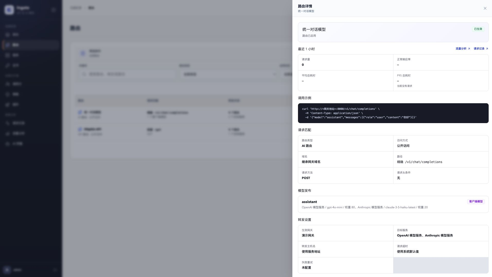
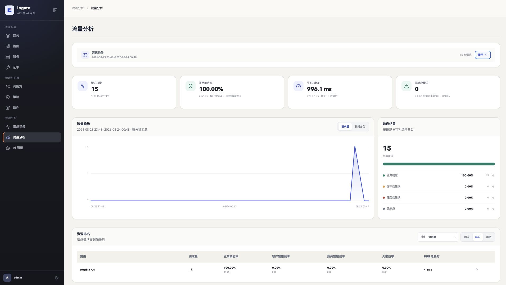
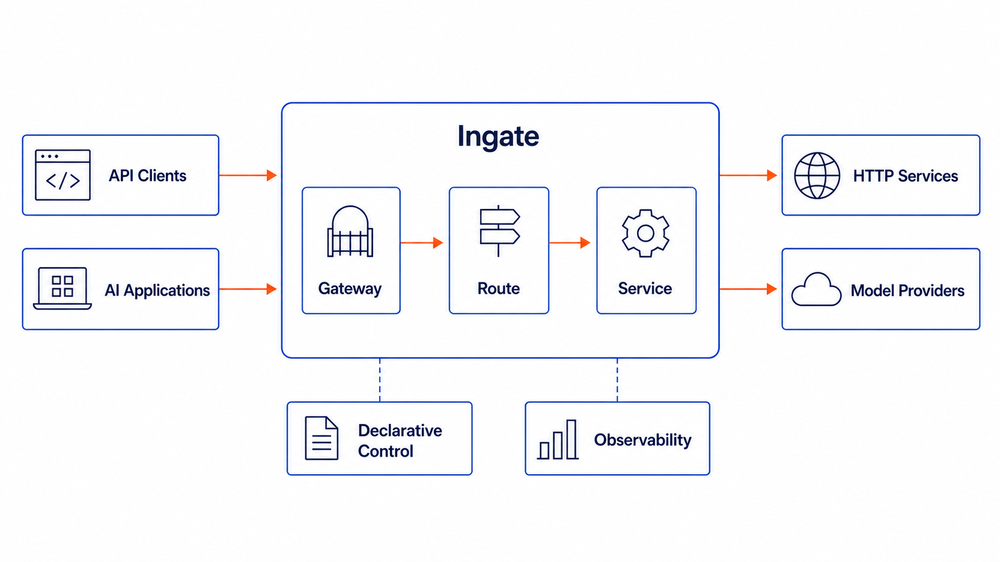

<div align="center">

# Ingate

**基于 Envoy 的声明式 API 与 AI 网关**

Ingate 取意于 **in + gate**：让进入系统的 API 与 AI 流量经过同一个可治理入口。

[](https://go.dev/)
[](https://www.envoyproxy.io/)
[](LICENSE)

</div>

> [完整文档](https://lgc202.github.io/ingate/) · [快速安装](https://lgc202.github.io/ingate/getting-started/installation/) · [系统架构](https://lgc202.github.io/ingate/concepts/architecture/)

## Ingate 是什么

Ingate 是一个使用官方 Envoy 作为数据平面的开源网关控制面。它用同一套产品模型管理普通 API 和大模型流量：

```text
Gateway -> Route -> Service
```

- **Gateway** 定义监听端口、域名和 TLS 入口
- **Route** 定义请求匹配、访问方式和转发目标
- **Service** 定义 HTTP 服务或模型厂商的端点、协议和凭据；在声明式 API 中对应 `Upstream` 资源

AI Route 可以把稳定的客户端模型名映射到不同厂商和协议的模型 Service。调用方始终使用 OpenAI Chat Completions 格式，不需要感知实际模型线路。

Ingate 不依赖 Kubernetes，不维护 Envoy 私有分支，也不为其他数据平面建立抽象。一套 Ingate 对应一个环境和配置域，其中可以创建多个 Gateway；生产、测试或租户之间的隔离通过部署多套 Ingate 实现。

## 核心能力

- **API 网关**：HTTP/HTTPS、Host/路径/方法/Header 匹配、加权转发、Host 重写、Header 转换、超时、重试和健康检查
- **AI 网关**：统一模型名、多模型线路、OpenAI 与 Anthropic 协议转换和流式响应
- **访问与治理**：公开或受保护 Route、调用方密钥与授权、IP 访问限制、共享请求限流和 Token 额度
- **声明式控制面**：资源 CRUD、List/Watch、乐观并发、Status、Envoy 配置编译和 xDS 下发
- **可观测性**：请求记录、转发结果、模型调用与 Token 用量、流量趋势和资源排行
- **运维助手**：查询实时配置与观测数据，定位故障，并审批创建 Gateway 或普通 HTTP Service
- **插件扩展**：请求响应转换、模拟响应、官方与自定义插件源，以及安装、升级、依赖检查和卸载

用户配置的是具有明确业务语义的 Policy，不需要编辑 Envoy 或 Wasm 私有参数。插件页只管理插件包的安装版本；安装插件不会改变流量，只有对应 Policy 应用到 Route 后才会生效。

## 快速开始

安装不需要源码、Go 或 Node.js。请先准备 Bash、curl、tar、`sha256sum`（Linux）或 `shasum`（macOS）、Docker Engine 和 Docker Compose v2：

```bash
curl -fsSL https://github.com/lgc202/ingate/releases/latest/download/install.sh | bash
```

安装完成后，终端会显示自动生成的管理员密码，使用用户名 `admin` 登录 Console。默认入口为：

- Console：<http://127.0.0.1:8001>
- HTTP Gateway：<http://127.0.0.1:8080>
- HTTPS Gateway：<https://127.0.0.1:8443>

Gateway 端口只有在 Console 中创建并成功发布对应 Gateway 后才会承载业务流量。安装固定版本、远程访问、升级、备份和卸载方式见 [Docker Compose 安装说明](deploy/compose/README.md)。

### 转发第一个 API 请求

在 Console 中依次创建：

1. HTTP Service：地址 `httpbin.org`，端口 `80`
2. HTTP Gateway：监听 `8080`，域名留空
3. API Route：路径前缀 `/`，目标选择刚创建的 Service，转发主机名选择“使用服务地址”

等待三个资源的状态都显示“已生效”，然后发送请求：

```bash
curl -i http://127.0.0.1:8080/get
```

正常情况下会收到 `HTTP/1.1 200 OK` 和 httpbin 返回的 JSON。随后可以在“请求记录”和“流量分析”中查看匹配结果、响应状态和耗时；分析数据异步写入，页面出现记录可能有短暂延迟。

### AI Route 调用格式

下面只展示客户端请求格式。先在 Console 中接入模型 Service、创建 AI Route，并将对外模型名设置为 `qwen-max`：

```bash
curl http://127.0.0.1:8080/v1/chat/completions \
  -H 'Content-Type: application/json' \
  -H 'Authorization: Bearer <access-key>' \
  -d '{
    "model": "qwen-max",
    "messages": [{"role": "user", "content": "你是谁"}],
    "stream": false
  }'
```

公开 Route 不需要 `Authorization` Header；受保护 Route 的访问密钥由“调用方”签发。

## Console 预览

### AI Route 模型发布



### 流量观测与分析



## 架构概览



Ingate 将配置管理、同步流量处理、异步观测和运维辅助分为四条链路：

1. **控制链路**：Console → Admin API → API Server → etcd；Controller Watch 资源并通过 xDS 向 Envoy 发布配置
2. **流量链路**：客户端 → Envoy → Service；Authz 校验调用方与请求限流，AI ExtProc 负责模型选择、凭据注入和协议转换
3. **观测链路**：Envoy ALS → Ingate ALS → Kafka → Analytics → ClickHouse
4. **助手链路**：Console → Assistant → Admin API；模型查询当前配置并生成无副作用提案，管理员显式批准后由 Assistant 确定性执行创建操作

Envoy 是唯一数据平面；etcd 只由 API Server 访问；Redis 保存实时限流、Token 额度计数和 Assistant 短期流式事件。各组件保持部署方式中立，Docker Compose 只是当前优先支持的安装与联调方式。

完整组件边界、通信方式和数据归属见 [系统架构](https://lgc202.github.io/ingate/concepts/architecture/)。

## 文档

| 主题 | 内容 |
| --- | --- |
| [认识 Ingate](https://lgc202.github.io/ingate/getting-started/introduction/) | 产品边界、流量模型和适用场景 |
| [系统架构](https://lgc202.github.io/ingate/concepts/architecture/) | 组件职责、控制链路、流量链路和观测链路 |
| [安装与运维](https://lgc202.github.io/ingate/operations/overview/) | 配置、健康检查、日志、备份和升级 |
| [运维助手](https://lgc202.github.io/ingate/operations/assistant/) | 模型连接、查询诊断、资源创建审批、会话和执行恢复 |
| [Docker Compose](deploy/compose/README.md) | 安装、启停、备份、恢复、升级和卸载 |
| [插件体系](https://lgc202.github.io/ingate/plugins/overview/) | 插件源、安装版本、强类型 Policy 和独立升级 |
| [Gateway](https://lgc202.github.io/ingate/traffic/gateway/) / [Route](https://lgc202.github.io/ingate/traffic/route/) / [Service](https://lgc202.github.io/ingate/traffic/service/) | 核心流量资源 |
| [IP 访问限制](https://lgc202.github.io/ingate/governance/ip-restriction/) / [请求限流](https://lgc202.github.io/ingate/governance/rate-limit/) / [Token 额度](https://lgc202.github.io/ingate/governance/token-quota/) | 治理策略与执行原理 |

## 当前范围

Ingate 当前已实现 API 转发、AI 模型发布、调用方授权、流量治理、插件管理、请求分析和带资源创建审批的运维助手。项目仍处于 `0.x` 快速演进阶段，资源协议和部署方式在 `1.0` 前可能调整。

以下能力不在当前范围：

- 资源更新与删除、Route 与模型 Service 创建、复杂审批、用户自定义 MCP 工具、多 Agent 编排和定时自动化
- 请求 Header、查询参数和正文的持久化
- Kubernetes CRD 和多数据平面适配

## 开发

源码开发需要 Go 1.27、Node.js 24、npm 11、Docker Engine 和 Docker Compose v2：

```bash
git clone https://github.com/lgc202/ingate.git
cd ingate
make check-tools
make docker-up
make docker-ps
```

常用命令：

```bash
make generate      # 生成 Proto、资源客户端、OpenAPI 和 Wire 代码
make lint          # 检查 Go、Proto 和 GitHub Actions
make test          # 编译全部 Go package
make verify        # 执行提交前完整检查
make docker-reset  # 删除本地数据卷并重建开发联调环境
```

更多命令可以通过 `make help` 查看。配置文件位于 [`configs`](configs)，本地 Compose 配置位于 [`deploy/docker`](deploy/docker)。

正式 Console 位于 `web/console`；`web/prototype` 只使用 Mock 数据验证产品设计，两者不共享业务代码或运行数据。

## 参与贡献

提交 Pull Request 前请阅读 [CONTRIBUTING.md](CONTRIBUTING.md) 并执行 `make verify`。安全问题请按照 [SECURITY.md](SECURITY.md) 使用 GitHub 私有漏洞报告。

## 许可证

Ingate 使用 [Apache License 2.0](LICENSE) 开源。
