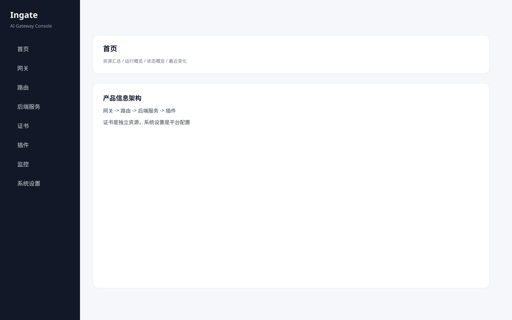

# Ingate 前端产品设计

本文档记录 Ingate 控制台第一版前端设计结果。目标是先把产品信息架构定住，再逐步替换成真实前端实现。

## 设计定位

Ingate 是统一网关控制台，不把 AI 单独拆成另一套系统。

核心对象：

```text
网关
路由
后端服务
证书
插件
```

AI 能力融入网关主线，后端服务承载应用、模型、Agent 和 MCP。

## 第一版导航

```text
首页
网关
路由
后端服务
证书
插件
监控
系统设置
```

## 页面边界

- 首页：只做资源汇总和运行概览
- 网关：入口监听、域名、证书绑定、数据面组
- 路由：匹配规则、后端转发、策略配置
- 后端服务：应用、模型服务、Agent、MCP
- 证书：TLS 凭据资源
- 插件：插件包、版本、部署范围、运行状态
- 监控：请求量、错误率、延迟、AI Token、调用日志
- 系统设置：环境、数据面组、用户、审计、通知、全局参数

## 列表页规范

- 查询条件区有明确 `查询` 和 `重置`
- 表格底部有 `上一页` / `下一页`
- 列表行操作统一是 `详情 / 编辑 / 删除`
- 时间列统一叫 `更新时间`
- 真实时间精确到秒

## 关键页面

### 首页


### 网关


### 路由


### 后端服务


### 证书


### 插件




### 监控


### 系统设置


## Admin API 方向

前端不直接感知 Kubernetes 风格资源，而使用产品 DTO。

```text
GatewayView
RouteView
BackendServiceView
CertificateView
PluginView
MonitorOverview
SystemSettingsView
```

## 插件化路线

Plugin-first，但不是 Plugin-only。插件负责能力扩展，路由负责启用和参数配置，插件页负责部署和运行状态。

```text
发布插件包 -> 部署到数据面组 -> 路由配置策略 -> 控制面下发 -> 数据面生效
```
