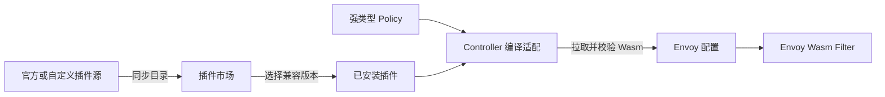

# Ingate 插件体系

Ingate 把“插件包的分发生命周期”和“网关策略配置”分开：插件页只负责发现、安装、升级和卸载 Wasm 制品，策略页负责用户真正要配置的治理语义。安装插件不会自动改变任何流量，只有对应强类型 Policy 绑定到 Gateway 或 Route 后才会生效。

## 三个对象

| 对象 | 作用 | 持久化位置 |
| --- | --- | --- |
| 插件源 | 发布受支持插件包的版本目录 | 官方源在进程配置；自定义源是声明式资源 |
| 已安装插件 | 固定当前使用的包、版本、制品地址和摘要 | API Server |
| 强类型 Policy | 描述用户可理解的配置和生效目标 | API Server |

插件源是独立发布渠道，不是任意 Wasm 的通用执行入口。它可以让内网镜像、离线制品或第三方发行渠道独立于 Ingate 主版本更新，但目录中的包必须已经被当前 Ingate 版本识别。API Server 和目录同步会拒绝没有执行契约的包，避免出现“安装成功但无法配置、无法编译”的假能力。

## 版本与升级

目录中的每个 Release 同时声明：

- 插件语义包名
- 插件版本
- 最低兼容 Ingate 版本
- OCI 或 HTTP(S) 制品地址
- SHA-256 摘要

Console 根据正在运行的 Ingate 版本选择兼容 Release，并比较已安装版本展示升级状态。插件可以单独发版和升级，不需要跟随 Ingate 主程序发版；升级只是把已安装资源切换到新的不可变版本和摘要，Controller 拉取并验证新制品后才会进入有效 Envoy 配置。

自定义插件源适合下面的场景：

- 企业把官方插件镜像同步到内网 Registry
- 在隔离环境中发布经过审计的固定版本
- 同一个受支持插件包由不同团队维护独立发布节奏

它目前不能绕过 Ingate 的产品协议直接引入一个全新策略类型。

## 新增一种插件需要什么

新增插件不是只上传一个 Wasm 文件。为了让能力能被用户配置、被 Controller 验证并稳定执行，需要同时提供：

1. 有明确业务语义的强类型 Policy，以及 Admin API 和 Console 表单
2. Controller 中从该 Policy 到 Envoy 配置的编译适配和冲突规则
3. Wasm 源码、构建入口和 OCI 制品发布配置
4. 插件元数据，包括包名、说明、兼容版本和制品仓库
5. 端到端验收场景，确认安装、配置、生效、升级和卸载依赖检查

这个边界与成熟 Envoy 网关采用的“扩展制品 + 控制面配置契约”一致：Wasm 负责数据面执行，控制面仍然必须理解并校验用户配置。Ingate 不向用户暴露任意 JSON、Envoy Filter 名称或 ABI 私有字段。

## 当前内置插件

- 请求响应转换：由 HeaderTransformationPolicy 配置请求与响应 Header 操作
- 模拟响应：由 MockResponsePolicy 配置固定状态码、Header 和正文

卸载前会检查是否仍有 Policy 依赖该插件；存在依赖时拒绝卸载。插件源停用或删除不会删除已经安装的插件，已安装版本仍按其固定制品信息运行。
