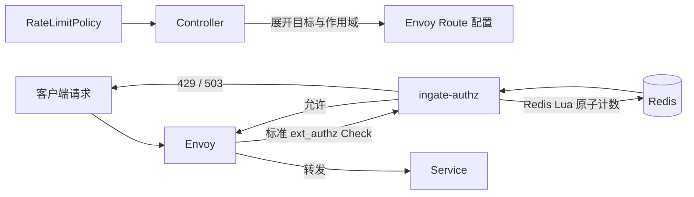

# RateLimitPolicy 资源

RateLimitPolicy 为 Gateway 或 Route 描述请求限流。用户只声明计数主体、请求上限、窗口和生效目标，不需要了解 Envoy Filter、Redis Key 或内部服务地址。

## 声明式资源

```yaml
apiVersion: gateway.ingate.io/v1
kind: RateLimitPolicy
metadata:
  name: 7c61aa86-3727-42fd-85d7-97c14f463875
spec:
  displayName: 登录接口限流
  enabled: true
  targetRefs:
    - kind: Route
      name: 93c0ca26-ff54-4b18-9da7-73ea51347395
  subject:
    type: IP
  limit:
    requests: 100
    windowSeconds: 60
```

`metadata.name` 是不可变资源 ID。`spec.displayName` 是同类资源内唯一的展示名称。

`targetRefs` 支持 Gateway 和 Route，可以为空。空列表表示策略已经保存但尚未应用；策略不会自动匹配未来创建的资源。Admin API 创建和更新时要求目标存在，直接使用声明式 API 写入的缺失目标由 `status.targets` 表达。

## 计数对象

`subject.type` 必须是以下类型之一：

- `Shared`：目标内所有请求共享额度
- `IP`：每个客户端 IP 独立使用额度
- `Header`：每个指定请求 Header 的值独立使用额度，此时必须填写 `headerName`

Header 名称不区分大小写，API Server 会统一保存为小写。Header 缺失的请求共享同一个空值额度桶。

策略应用到 Route 时，额度只统计该 Route。策略应用到 Gateway 时，额度统计该 Gateway 下的全部请求。一个策略引用多个目标时，每个目标拥有独立额度；同一请求命中多条策略时必须同时通过全部检查。

如果同一策略同时通过 Gateway 和 Route 引用命中同一请求，只执行一次，并使用更精确的 Route 作为计数范围。

## 额度语义

`limit.requests` 表示 `limit.windowSeconds` 秒内允许的请求数。两个字段范围都是 `1-2147483647`。

当前使用与 Unix 时间对齐的固定窗口。例如窗口为 60 秒时，同一分钟内的请求使用同一个计数器；到达下一个分钟边界后进入新窗口。多个 Authz 实例通过 Redis 共享计数，Lua 脚本原子完成“检查上限并递增”，不会因并发请求突破配置上限。

命中多条策略时按稳定顺序逐条检查，全部通过才允许请求进入上游。每条策略拥有独立计数器；如果请求通过前一条策略、随后被另一条策略拒绝，前一条策略仍会把这次尝试计入额度。这避免跨多个 Redis Cluster hash slot 运行一个多 Key 事务，也符合多个独立治理规则分别统计请求尝试的语义。

超限时网关返回 HTTP `429 Too Many Requests`，响应包含 `Retry-After`，表示距离当前窗口结束至少还需等待的秒数。Redis 不可用或计数执行失败时采用失败关闭，Envoy 返回 `503 Service Unavailable`，不会绕过已声明的限流规则。

Redis Key 只保存策略 ID、作用域和主体值的摘要，并在窗口结束后自动过期。Header 主体的原始值不会写入 Key 或日志。

## 执行链路



Controller 已经把 Gateway/Route 引用解析成 Route 级执行规则，Authz 不读取用户的策略挂载关系。公开 Route 只有在命中限流策略时才调用 Authz；它不会因此要求调用方密钥，也不会移除属于上游业务的 `Authorization` Header。

## Admin API

Admin API 返回平铺的限流策略对象：

```json
{
  "id": "7c61aa86-3727-42fd-85d7-97c14f463875",
  "name": "登录接口限流",
  "enabled": true,
  "targets": [
    {
      "kind": "POLICY_TARGET_KIND_ROUTE",
      "id": "93c0ca26-ff54-4b18-9da7-73ea51347395",
      "name": "用户登录",
      "state": "READY",
      "message": "配置已生效"
    }
  ],
  "subject": {"type": "RATE_LIMIT_SUBJECT_TYPE_IP"},
  "limit": {"requests": 100, "windowSeconds": 60},
  "state": "READY",
  "message": "配置已生效",
  "version": 3,
  "createdAt": "2026-08-10T10:00:00Z",
  "updatedAt": "2026-08-10T10:15:00Z"
}
```

查询、创建和更新接口直接返回 RateLimitPolicy，删除成功返回空对象。列表使用不透明的 `limit/cursor` 游标分页。更新和删除必须提交映射 `metadata.generation` 的 `version`。

不提供独立启停接口，启停和其他字段一样通过完整资源更新完成。停用配置进入当前生效版本后状态为 `DISABLED`；没有目标的启用策略状态为 `READY`，消息为“策略已保存，尚未应用”。

总体状态表示策略是否至少在一个目标生效，每个目标的解析和生效结果由 `targets[]` 独立返回。一个无效目标不会阻塞其他有效目标。

## MVP 边界

当前固定使用跨实例共享的固定窗口，不提供单实例计数、滑动窗口选择、自定义 Burst、Query/Cookie 计数、复合计数 Key、自定义超限响应、自定义失败策略、按标签选择目标和运行时用量查询。路径、Method 和 Header 条件由 Route 负责匹配，不在 RateLimitPolicy 中重复定义。

IP 主体使用 Envoy 看到的下游源地址。当前没有把任意 `X-Forwarded-For` 当作可信客户端地址；部署在外部代理之后时，需要先明确可信代理边界再扩展该能力。
