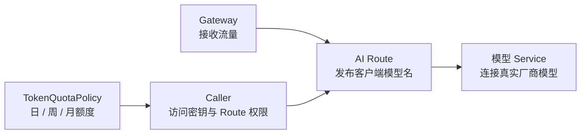
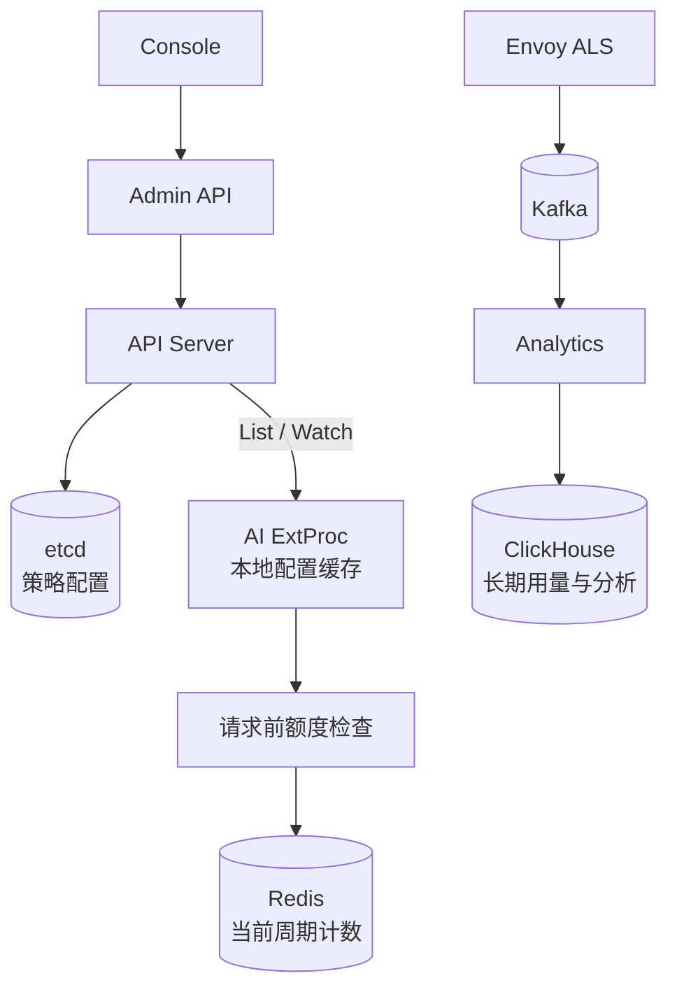
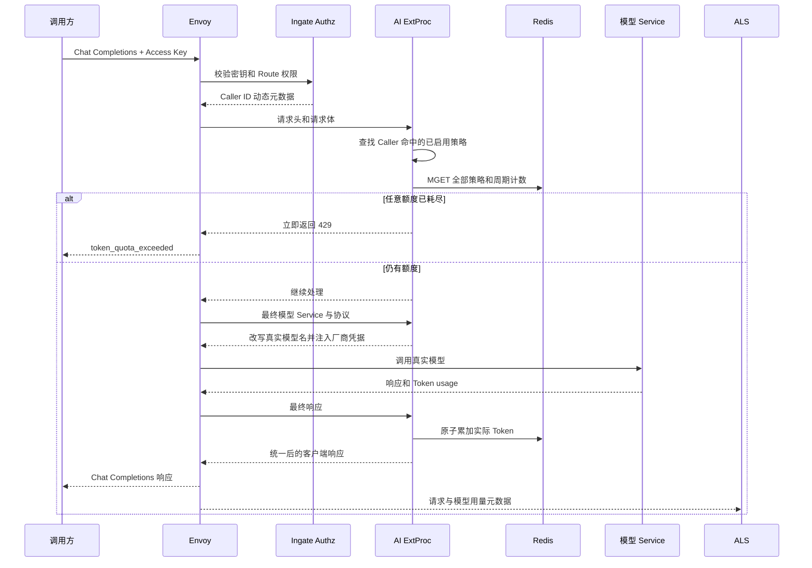

# TokenQuotaPolicy 原理与使用

TokenQuotaPolicy 用于限制一个调用方在自然日、自然周或自然月内可以消费的模型 Token 总量。它面向 AI Route，不限制普通 HTTP 请求数，也不负责模型厂商账户的余额、账单或充值。

这项能力解决的是“某个应用在一段时间内最多可以消耗多少模型资源”：

- 配置保存在声明式 API 中，可审计、可复用、可启停
- 调用方通过访问密钥被识别，每个调用方独立计数
- 输入 Token 和输出 Token 按模型服务实际返回的用量结算
- 当前周期计数保存在 Redis，所有 AI ExtProc 实例共享
- 长期用量仍进入 ClickHouse，用于查询和分析，但不参与请求放行判断

## 产品语义

Token 额度只应用到 Caller。Gateway 和 Route 决定流量入口与转发规则，Caller 表示实际使用网关的应用或服务，TokenQuotaPolicy 则给 Caller 设置模型资源预算。



当前遵循以下规则：

1. 调用方没有关联任何已启用策略时，不限制 Token
2. 策略没有选择调用方时，只保存配置，不影响流量
3. 策略停用后不检查额度，也不结算新的 Token
4. 一条策略至少配置一个周期；未配置的周期不限制
5. 日、周、月额度可以同时存在，请求必须同时满足所有周期
6. 同一调用方命中多条策略时，所有策略都生效，任意一项耗尽都会拒绝请求
7. 同一策略可以关联多个调用方，但每个调用方拥有独立计数
8. 只有能识别 Caller 的请求才执行额度检查；公开 AI Route 当前不执行 Caller 额度

例如，一条策略同时配置每日 20,000 Token 和每月 300,000 Token。调用方当天仍有额度、但本月额度已经耗尽时，请求仍会被拒绝。

## 声明式资源

```yaml
apiVersion: gateway.ingate.io/v1
kind: TokenQuotaPolicy
metadata:
  name: 0c153c24-7698-4cf2-81b9-cac468c45a6a
spec:
  displayName: 客服助手模型额度
  enabled: true
  targetRefs:
    - kind: Caller
      name: 5286d2e8-b7ba-4c2c-9946-7483c0782318
  timeZone: Asia/Shanghai
  limits:
    - period: Day
      tokens: 20000
    - period: Week
      tokens: 100000
    - period: Month
      tokens: 300000
```

`metadata.name` 是不可变资源 ID，`spec.displayName` 是控制台展示名称。`targetRefs` 只允许引用 Caller，可以为空；每种周期在一条策略中最多出现一次。

`tokens` 表示输入和输出 Token 的总和，必须是大于 0 的整数。当前最大值为 `9007199254740991`，确保 Admin API、JSON 和前端都能无损表达。

## 自然周期与时区

额度使用自然周期，不使用“从第一次调用开始滚动 24 小时”之类的滑动窗口：

| 周期 | 开始时间 | 结束时间 |
| --- | --- | --- |
| Day | 策略时区当天 00:00 | 下一天 00:00 |
| Week | 策略时区本周一 00:00 | 下一周周一 00:00 |
| Month | 策略时区本月 1 日 00:00 | 下个月 1 日 00:00 |

`timeZone` 必须是 IANA 时区，例如 `Asia/Shanghai`、`UTC` 或 `America/New_York`。周期边界按该时区计算，因此夏令时地区的一天不一定始终是 24 小时。

修改策略时区不会搬迁旧计数。新请求会按照新时区计算新的周期起点，并使用对应的新计数 Key；旧 Key 会在过期后自动清理。

## 配置如何生效

TokenQuotaPolicy 是配置事实，不存放实时用量。配置和计数使用两条不同的数据路径：



- etcd 保存策略名称、启停状态、调用方引用、时区和额度上限
- AI ExtProc 通过 API Server 的 List/Watch 维护本地只读缓存，不在每次请求时查询 API Server
- Redis 保存当前周期已经消费的 Token，是同步放行判断的数据来源
- ClickHouse 保存异步请求记录和模型用量，用于趋势、排行和排障，不作为同步额度计数器

因此 Analytics 或 ClickHouse 暂时不可用不会改变额度判断；Redis 不可用则会直接影响命中额度策略的请求。

## 一次请求如何执行



具体分成两个阶段。

### 1. 请求前检查

AI ExtProc 从前置 Authorization 写入的 Envoy 动态元数据中取得 Caller ID，然后从本地缓存查找该 Caller 命中的全部已启用策略。

每个“调用方 + 策略 + 周期”会形成一个额度桶。AI ExtProc 使用一次 Redis `MGET` 读取本次请求涉及的全部额度桶：

- 当前用量小于上限：允许请求继续
- 当前用量大于或等于上限：不调用模型 Service，立即返回 HTTP `429`
- 没有命中策略：跳过 Redis，继续请求

超限响应保持 OpenAI 兼容错误结构，并返回 `Retry-After`，其值是当前超限周期距离重置时间的秒数：

```http
HTTP/1.1 429 Too Many Requests
Content-Type: application/json
Retry-After: 86400

{
  "error": {
    "message": "Daily token quota exceeded. Try again after the quota resets.",
    "type": "rate_limit_error",
    "code": "token_quota_exceeded"
  }
}
```

### 2. 响应后结算

模型调用前无法知道最终会产生多少 Token，因此 Ingate 不预扣一个估计值。模型响应返回后，AI ExtProc 从厂商响应中提取实际用量，再把 `total_tokens` 同时累加到本次请求命中的全部额度桶。

- OpenAI 兼容非流式响应读取 `usage.prompt_tokens`、`usage.completion_tokens` 和 `usage.total_tokens`
- OpenAI 兼容流式请求会自动启用 `stream_options.include_usage`
- Anthropic 的输入、缓存读取、缓存写入和输出 Token 会归一为统一的输入、输出和总 Token
- 厂商没有返回可识别的 usage 时，本次调用无法结算，不使用字符数或本地 tokenizer 猜测

一次请求只结算一次。模型线路的内部选择和协议转换不会导致同一份最终 usage 被重复累计。

请求通过检查时会保存本次命中的策略和额度桶。即使管理员在模型响应返回前修改或停用策略，当前请求仍结算到开始时已经检查过的桶；下一次请求才使用更新后的配置。这样可以避免一次调用在检查和结算阶段使用两套不同规则。

## 配置变更会不会重置计数

更新策略不会自动重置当前周期计数。计数 Key 使用不可变 Policy ID，而不是可编辑的策略名称：

- 调低上限：下一次请求按新上限检查，已用量达到新上限时立即拒绝
- 调高上限：下一次请求可以继续使用新增额度
- 停用后重新启用：同一周期尚未过期的计数继续使用，停用期间的调用不计入该策略
- 暂时移除后重新关联同一 Caller：同一周期尚未过期的计数继续使用
- 新增一个周期：该周期此前没有执行计数，从启用后的成功调用开始累计，不追溯本周期已有的历史调用
- 删除策略后重新创建：新资源拥有新的 Policy ID，因此使用新的计数空间

修改时区可能改变周期起点，从而切换到不同的计数 Key；旧 Key 不会迁移，会在自身过期时间到达后清理。Ingate 当前不提供“保存策略并清空额度”的组合操作，避免普通配置编辑意外重置正在使用的预算。

## 为什么当前调用可以越过上限

额度检查发生在调用前，实际结算发生在响应后。例如每周上限为 100,000，当前已经使用 99,000：

1. 新请求开始时 `99,000 < 100,000`，请求被允许
2. 模型实际返回 3,000 Token
3. 结算后本周累计变成 102,000
4. 下一次请求看到 `102,000 >= 100,000`，返回 `429`

高并发时，多个请求也可能同时在额度尚未耗尽时通过检查，然后分别完成结算。因此 TokenQuotaPolicy 是周期预算保护，不是绝不越过一枚 Token 的硬性预付费余额。

若要实现严格硬上限，需要在请求前根据最大输出和输入预留额度，响应后再做差额回补。这会引入预估偏差、取消请求回收、超时悬挂预留和多线路重试结算等复杂语义，当前 MVP 不提供。

## Redis 计数模型

Redis Key 的逻辑结构是：

```text
ingate:token-quota:{callerID}:{policyID}:{period}:{periodStartUnix}
```

例如：

```text
ingate:token-quota:{5286d2e8-b7ba-4c2c-9946-7483c0782318}:0c153c24-7698-4cf2-81b9-cac468c45a6a:week:1785168000
```

Key 同时包含 Caller ID 和 Policy ID，因此：

- 同一策略应用到多个 Caller 时不会共享用量
- 同一 Caller 命中多个策略时，每条策略独立累计
- 新周期通过新的 `periodStartUnix` 自动得到新桶，不需要定时任务清零

结算通过 Redis Lua 脚本一次完成：脚本对本次请求的日、周、月以及多策略 Key 执行 `INCRBY`，并在 Key 首次出现时设置过期时间。过期时间为周期结束后再保留 7 天，既避免周期切换瞬间删除旧数据，也能自动回收历史计数。

Key 使用 Caller ID 作为 Redis Cluster hash tag。同一请求涉及的 Key 会落到同一个 slot，使一段 Lua 脚本仍能原子更新全部额度桶。

需要注意，原子结算只能保证一次响应涉及的多个计数一起更新；请求前的读取与响应后的结算不是一个 Redis 事务，这正是并发请求可能越过上限的原因。

## 多策略示例

假设调用方“客服助手”命中两条策略：

| 策略 | 周期 | 上限 | 当前用量 |
| --- | --- | ---: | ---: |
| 团队公共预算 | Month | 2,000,000 | 1,200,000 |
| 客服助手保护 | Day | 50,000 | 50,000 |

虽然月度预算仍有余额，但每日额度已经耗尽，请求会被拒绝。一个成功调用返回 800 Token 时，如果两个额度都未耗尽，800 会同时计入这两个策略对应的桶；这不是重复计费，而是同一次使用同时受两种预算约束。

## 故障与一致性语义

| 场景 | 当前行为 |
| --- | --- |
| 策略未关联 Caller | 保存配置但不检查、不计数 |
| 策略被停用 | 后续请求不检查，也不写入该策略计数 |
| API Server Watch 暂时断开 | AI ExtProc 继续使用已经同步的本地缓存，连接恢复后继续更新 |
| Redis 读取失败 | 命中额度策略的请求失败，不静默绕过额度 |
| Redis 结算失败 | 模型成功响应仍返回客户端，记录错误日志，不诱发客户端重试 |
| 模型响应没有 usage | 响应正常返回，但无法增加实时额度计数 |
| Analytics 或 ClickHouse 不可用 | 不影响实时额度判断；请求记录和用量分析会延迟 |
| Redis 当前周期数据丢失 | 实时计数从缺失值重新开始，ClickHouse 不会自动反向重建 Redis |

AI ExtProc 是 AI Route 正确执行的一部分，Envoy 对它使用 fail-closed 配置。额度检查、模型名改写或协议转换发生内部错误时，不会把未经处理的请求直接发送给模型厂商。

Redis 保存的是实时执行状态，不是可追溯账单。生产环境应为 Redis 配置持久化、备份和符合可用性目标的部署方式；Docker Compose 默认启用 AOF 并挂载独立 Volume。

## 实时计数与长期用量的区别

| 数据 | 存储 | 用途 | 是否参与放行 |
| --- | --- | --- | --- |
| TokenQuotaPolicy | etcd | 保存额度规则 | 是 |
| 当前周期计数 | Redis | 请求前快速判断、响应后结算 | 是 |
| 模型调用与 Token 用量 | ClickHouse | 请求明细、趋势、排行、长期分析 | 否 |

Redis 和 ClickHouse 记录的是同一业务调用的不同侧面。Redis 追求同步判断的低延迟；ClickHouse 追求长期查询和聚合。不能在每次请求前查询 ClickHouse，也不能把会自动过期的 Redis 计数当作永久用量账本。

两条链路短时间内可能不完全一致：Redis 在模型响应阶段同步结算，而 ClickHouse 数据需要经过 ALS、Kafka 和 Analytics 异步写入。排障时应先区分“实时执行计数”和“异步分析数据”。

## 使用步骤

1. 创建模型 Service 和 AI Route
2. 把 AI Route 的访问方式设置为需要调用方密钥
3. 创建 Caller，为其授权对应 AI Route，并保存访问密钥
4. 在“策略”页面创建 Token 额度策略
5. 选择周期时区以及每日、每周或每月上限
6. 在“应用调用方”中选择一个或多个 Caller
7. 使用 Caller 的访问密钥调用 AI Route

只配置额度策略但使用公开 AI Route 不会产生 Caller 身份，因此不会执行 Caller 额度。需要额度治理的 AI Route 应使用调用方访问模式。

## 当前边界

当前版本不提供：

- 按 Gateway、Route、模型、模型 Service 或 Access Key 单独计数
- 货币金额预算、厂商价格表和账单结算
- 额度充值、手动扣减、手动重置和结转
- 剩余额度查询、阈值告警和通知
- 严格预留式硬上限
- 使用本地 tokenizer 估算厂商未返回的 Token
- 从 ClickHouse 自动重建 Redis 计数
- 对失败的内部模型尝试单独扣减额度

这些能力只有在明确产品场景下才会扩展，不把 TokenQuotaPolicy 演变成通用计费系统。
