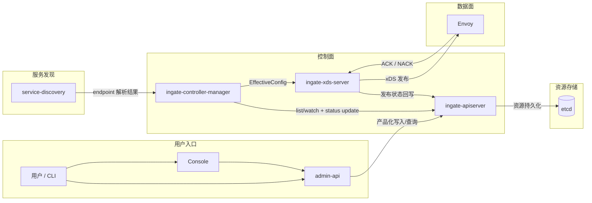

# Ingate v1 总览

## 1. 定位

`Ingate` 不是复刻 `Higress`，也不是复刻 `OneX`。

它的方向是：

- 借 `OneX` 的控制面底座与工程组织方式
- 做 `Higress` 风格的网关业务建模与 Envoy/xDS 主链路
- 保留后续接入 Kubernetes / Gateway API / AI 扩展的演进空间

v1 的核心定位是：

- 以 `Envoy` 为数据面
- 以 `generic apiserver + etcd + controller-manager` 为控制面底座
- 以声明式资源模型驱动网关配置
- 通过 `xDS` 向 Envoy 动态下发配置
- 支持裸机、Docker，以及后续部署到 Kubernetes

## 2. v1 范围

### 2.1 包含

- `Gateway`
- `Route`
- `Backend`
- `AuthPolicy`
- `TrafficPolicy`
- `etcd` 作为资源真相源存储
- `generic apiserver` 风格资源服务
- `controller-manager` 风格控制循环
- `IR`
- `xDS`
- `Envoy`
- `static / dns` 服务发现
- 基础日志、指标、状态反馈

### 2.2 不包含

- 直接以 `CRD` 作为默认运行时入口
- 完整 Kubernetes Gateway API 兼容
- 多集群
- 完整插件平台
- 完整 AI provider / model routing 抽象
- Istio 依赖

## 3. 核心设计原则

- 控制面与数据面严格分离
- 资源语义与 Envoy 配置细节严格分离
- northbound 采用声明式资源模型
- `spec/status`、版本、watch、reconcile 必须是第一天就成立的能力
- `Gateway / Route / Backend / Policy` 分离建模
- v1 优先做“正确的控制面底座”，不是“尽快拼出一个可用代理”

## 4. 顶层组件

v1 的长期稳定组件收敛为：

- `ingate-apiserver`
- `ingate-controller-manager`
- `ingate-xds-server`
- `envoy`
- `service-discovery`
- `admin-api`
- `console`（可选）

### 4.1 `ingate-apiserver`

职责：

- 提供声明式资源 API
- 持久化资源 `spec/status`
- 提供 `list/watch`
- 提供资源版本语义

### 4.2 `ingate-controller-manager`

职责：

- 通过 watch 消费资源变更
- 执行校验、默认值、依赖解析、策略绑定
- 构建 `IR`
- 回写状态

### 4.3 `ingate-xds-server`

职责：

- watch `ResolvedGateway`
- 将 `ResolvedGateway` 翻译为发布运行态
- 管理当前发布版本与本地缓存
- 向数据面提供配置发现能力
- 将发布结果映射为 `Programmed`

### 4.4 `envoy`

职责：

- 实际执行路由、认证、限流、超时、重试
- 产生日志、指标与追踪

### 4.5 `service-discovery`

职责：

- 解析 `Backend` 的上游实例
- v1 支持 `static / dns`
- 后续可扩 `k8s service / nacos / consul`

### 4.6 `admin-api`

职责：

- 面向用户和外部平台提供产品化接口
- 组织多资源写入与聚合查询
- 不直接承担资源真相源职责

### 4.7 `console`

职责：

- 面向用户提供管理界面
- 作为 `admin-api` 的前端消费者

## 5. 顶层数据流

```text
用户 / Console / CLI
  -> admin-api
  -> ingate-apiserver
  -> ingate-controller-manager
  -> IR
  -> ingate-xds-server
  -> Envoy
```

服务发现作为横向输入进入 `ingate-controller-manager`。



## 6. 推荐物理部署

v1 推荐的物理部署单元：

- `ingate-apiserver`
- `ingate-controller-manager`
- `ingate-xds-server`
- `envoy`
- `console`（可选）
- `etcd`

v1 默认按独立组件设计和部署，不以内存通信或合并控制面作为默认形态。

## 7. 文档入口

从这里开始继续阅读：

- [设计文档索引](./README.md)

推荐顺序：

1. [核心概念](./00-core-concepts.md)
2. 当前文档
3. [资源模型](./02-resource-model.md)
4. [控制面核心](./03-control-plane.md)
5. [发布链路与 xDS](./04-delivery-and-xds.md)
6. [管理接口与 API 分层](./05-api-and-management.md)
7. [组件通信与安全边界](./06-component-communication-and-security.md)
8. [代码架构与生成链路](./07-code-architecture-and-codegen.md)
9. [可用性、恢复与测试](./08-reliability-and-testing.md)
