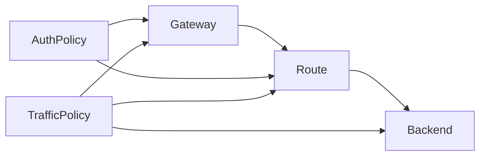

# Ingate v1 资源模型

## 1. 设计目标

`Ingate` 的资源模型同时服务两件事：

- 对外提供声明式资源语义
- 对内支撑 `ingate-apiserver -> ingate-controller-manager -> ingate-xds-server` 的控制链路

因此 v1 的资源对象统一采用 Kubernetes 风格外形：

- `apiVersion`
- `kind`
- `metadata`
- `spec`
- `status`

但最终用户不需要直接理解底层资源对象；用户交互应通过 `console` 或更友好的管理接口完成。

## 2. v1 核心资源

v1 先收敛为 5 个核心资源：

- `Gateway`
- `Route`
- `Backend`
- `AuthPolicy`
- `TrafficPolicy`

这 5 个资源足以覆盖：

- 入口定义
- 路由转发
- 上游抽象
- 认证
- 基础流量治理

## 3. 资源关系



## 4. 资源职责

### 4.1 Gateway

职责：

- 定义网关入口
- 定义 listener
- 作为 route 挂载点
- 承载 gateway 级策略

### 4.2 Route

职责：

- 定义请求匹配规则
- 绑定一个主 `Backend`
- 承载 route 级策略

### 4.3 Backend

职责：

- 表示上游服务抽象
- 定义发现方式与端点来源
- 承载 backend 级治理策略

### 4.4 AuthPolicy

职责：

- 定义认证行为
- 可以绑定到 `Gateway` 或 `Route`

### 4.5 TrafficPolicy

职责：

- 定义限流、超时、重试等流量治理行为
- 可以绑定到 `Gateway`、`Route` 或 `Backend`

## 5. v1 的基础资源语义

### 5.1 metadata

v1 至少支持这些字段：

- `metadata.name`
- `metadata.labels`
- `metadata.annotations`
- `metadata.generation`

### 5.2 spec

`spec` 表示用户声明的期望状态。

`ingate-controller-manager` 读取 `spec`，通过各类 controller/reconciler 将其解释为最终生效语义。

### 5.3 status

`status` 表示系统已经观测到的实际状态。

v1 至少应支持：

- `status.observedGeneration`
- `status.conditions`
- 发布状态
- 解析或发布错误信息

## 6. 与控制器的关系

这些资源不是“写进去就立即生效”的命令对象，而是 controller 驱动的声明式对象。

v1 中，`ingate-controller-manager` 内部至少会有以下控制循环：

- `gateway controller`
- `route controller`
- `backend controller`
- `authpolicy controller`
- `trafficpolicy controller`

这些 controller 共同负责：

- 校验
- 默认值填充
- 引用解析
- 策略绑定
- 状态回写

## 7. 延后引入的资源

以下资源不属于 v1 核心集合：

- `Consumer`
- `PluginPolicy`
- `AIProvider`
- `ModelRoute`
- `WasmPlugin`

## 8. 待补充项

后续继续细化：

- 每个资源的精确 `spec` 结构
- `conditions` 枚举与状态机
- 资源引用校验规则
- 资源版本与并发更新语义

统一的 `status/conditions` 规范见：

- [状态模型与 Condition 规范](./03-control-plane.md)

## 9. Gateway 字段草案

`Gateway` 是 v1 的入口资源。

它只负责：

- 定义 listener
- 定义入口协议
- 定义 TLS 终止入口
- 作为 `Route` 的挂载目标

它不负责：

- 定义具体路径匹配
- 定义转发到哪个 backend
- 直接内嵌认证、限流、重试等策略

### 9.1 设计结论

v1 的 `Gateway`：

- 支持 `HTTP`
- 支持 `HTTPS`
- 不支持 `TCP`
- 不支持 `UDP`
- 不支持 `TLS passthrough`

但模型必须预留未来协议扩展能力。

### 9.2 spec 草案

```yaml
apiVersion: gateway.ingate.io/v1alpha1
kind: Gateway
metadata:
  name: public-gateway
spec:
  listeners:
    - name: web
      protocol: HTTP
      port: 80
      hostname: api.example.com
    - name: websecure
      protocol: HTTPS
      port: 443
      hostname: api.example.com
      tls:
        mode: Terminate
        certificateRef:
          name: default-cert
  allowedRoutes:
    kinds:
      - Route
```

### 9.3 spec 字段说明

#### `spec.listeners`

类型：

- 数组

要求：

- v1 必须支持多个 listener
- listener 的 `name` 在同一 `Gateway` 内必须唯一

#### `spec.listeners[].name`

作用：

- 标识 listener
- 用于状态回写和 route attachment 追踪

#### `spec.listeners[].protocol`

v1 允许值：

- `HTTP`
- `HTTPS`

设计要求：

- 枚举值按可扩展方式设计
- 后续可扩 `TCP`、`TLS`、`GRPC`

#### `spec.listeners[].port`

作用：

- 定义入口监听端口

v1 约束：

- 端口必须为有效 TCP 端口
- 同一 `Gateway` 内不允许 listener 端口/协议冲突

#### `spec.listeners[].hostname`

作用：

- 定义该 listener 接收的主机名范围

v1 建议：

- 支持单 hostname
- 后续如有需要再扩数组或通配能力

#### `spec.listeners[].tls`

只在 `HTTPS` listener 下出现。

v1 最小结构：

```yaml
tls:
  mode: Terminate
  certificateRef:
    name: default-cert
```

字段要求：

- `mode` v1 先只支持 `Terminate`
- `certificateRef` 表示证书引用

#### `spec.allowedRoutes`

作用：

- 限定什么资源类型可以挂到该 `Gateway`

v1 最小约束：

- 只允许 `Route`

保留它的原因不是为了现在做复杂权限，而是为了后续 route attachment 规则演进不需要重做模型。

### 9.4 status 草案

```yaml
status:
  observedGeneration: 3
  conditions:
    - type: Accepted
      status: "True"
      reason: Accepted
  listeners:
    - name: web
      attachedRoutes: 2
      conditions:
        - type: Programmed
          status: "True"
          reason: Programmed
    - name: websecure
      attachedRoutes: 2
      conditions:
        - type: ResolvedRefs
          status: "True"
          reason: CertificateResolved
```

### 9.5 status 字段说明

#### `status.observedGeneration`

作用：

- 表示控制器已经处理到哪个资源版本

#### `status.conditions`

作用：

- 表达 `Gateway` 整体是否被接受、是否存在错误、是否已发布

v1 至少应覆盖：

- `Accepted`
- `Programmed`
- `ResolvedRefs`

#### `status.listeners`

作用：

- 表达每个 listener 的实际生效状态

v1 至少包含：

- `name`
- `attachedRoutes`
- `conditions`

### 9.6 v1 最小校验规则

`Gateway` 至少需要这些校验：

- `listeners` 不能为空
- `listener.name` 不能为空且唯一
- `listener.protocol` 必须是 `HTTP` 或 `HTTPS`
- `HTTPS` listener 必须提供 `tls`
- `HTTP` listener 不应携带 `tls`
- listener 之间不允许端口/协议冲突
- `allowedRoutes.kinds` 为空时按默认只允许 `Route`

## 10. Route 字段草案

`Route` 是 v1 的 HTTP 路由资源。

它只负责：

- 定义请求匹配规则
- 定义匹配后的转发目标
- 挂载到 `Gateway`

它不负责：

- 定义入口端口
- 定义 TLS
- 直接内嵌认证、限流、重试策略

### 10.1 设计结论

v1 的 `Route`：

- 只建模 HTTP 路由
- 借鉴 `Gateway API HTTPRoute` 的方向
- 但不直接照搬完整 `HTTPRoute` 能力集合

### 10.2 spec 草案

```yaml
apiVersion: gateway.ingate.io/v1alpha1
kind: Route
metadata:
  name: orders-route
spec:
  parentRefs:
    - name: public-gateway
  hostnames:
    - api.example.com
  rules:
    - matches:
        - path:
            type: PathPrefix
            value: /orders
          method: GET
          headers:
            - name: x-region
              value: hz
      backendRefs:
        - name: orders-backend
          port: 8080
          weight: 100
```

### 10.3 spec 字段说明

#### `spec.parentRefs`

作用：

- 声明该 `Route` 挂到哪个 `Gateway`

v1 约束：

- 至少包含一个 `Gateway` 引用
- 先不引入 namespace 和跨 namespace 挂载

#### `spec.hostnames`

作用：

- 进一步限制该 `Route` 匹配的 host

v1 建议：

- 支持字符串数组
- 与 `Gateway.listener.hostname` 共同决定最终路由生效范围

#### `spec.rules`

类型：

- 数组

作用：

- 每条 rule 表达一组匹配条件和对应的 backend 转发目标

#### `spec.rules[].matches`

v1 支持的匹配维度：

- `path`
- `method`
- `headers`

v1 不支持：

- query 参数匹配
- body 匹配
- 大规模正则能力

#### `spec.rules[].matches[].path`

v1 允许：

- `Exact`
- `PathPrefix`

不建议 v1 直接做复杂正则路径匹配。

#### `spec.rules[].matches[].method`

作用：

- 限定 HTTP 方法

v1 建议：

- 使用标准 HTTP 方法枚举

#### `spec.rules[].matches[].headers`

作用：

- 基于请求头做额外匹配

v1 最小能力：

- 精确匹配 header 名和值

#### `spec.rules[].backendRefs`

作用：

- 定义匹配成功后的上游目标

v1 支持：

- 多 backend 引用
- 按 `weight` 做权重分配

v1 不支持：

- 流量镜像
- 复杂 canary DSL
- 脚本化 backend 选择

### 10.4 status 草案

```yaml
status:
  observedGeneration: 2
  conditions:
    - type: Accepted
      status: "True"
      reason: Accepted
    - type: ResolvedRefs
      status: "True"
      reason: BackendResolved
  parents:
    - name: public-gateway
      conditions:
        - type: Accepted
          status: "True"
          reason: Attached
```

### 10.5 status 字段说明

#### `status.observedGeneration`

作用：

- 表示控制器已经处理到哪个版本的 `Route`

#### `status.conditions`

作用：

- 表示 `Route` 整体是否合法、引用是否解析成功、是否已发布

v1 至少应覆盖：

- `Accepted`
- `ResolvedRefs`
- `Programmed`

#### `status.parents`

作用：

- 表示 `Route` 挂载到各个 `Gateway` 的结果

这很重要，因为：

- `Route` 自己合法
- 不代表一定成功挂载到目标 `Gateway`

### 10.6 v1 最小校验规则

`Route` 至少需要这些校验：

- `parentRefs` 不能为空
- `rules` 不能为空
- 每条 rule 至少有一个 `match`
- 每条 rule 至少有一个 `backendRef`
- `path.type` 只允许 `Exact` 或 `PathPrefix`
- `backendRef.weight` 必须合法
- 被引用的 `Gateway` 和 `Backend` 必须存在

### 10.7 后续扩展点

以下能力 v1 不做，但模型设计时必须留好扩展空间：

- query 参数匹配
- cookie 匹配
- 更复杂的 header 匹配条件
- 正则路径匹配
- redirect / rewrite
- request / response header modification
- traffic mirror
- canary / 灰度发布能力
- 多种 backend selection 策略
- 与插件系统或外部处理器的 route 级挂载关系

## 11. Backend 字段草案

`Backend` 是 v1 的上游服务抽象。

它表达的是：

- 这个上游是什么
- 通过什么方式发现实例
- 默认监听什么端口
- 当前解析出的 endpoint 是什么

它不等于：

- Route 中直接写死的地址列表
- 运行时某一瞬间的 endpoint 快照本身

### 11.1 设计结论

v1 的 `Backend`：

- 支持 `Static`
- 支持 `DNS`
- 为后续 `KubernetesService / Nacos / Consul` 预留扩展位

并且必须坚持：

- `spec` 描述发现方式和期望配置
- `status` 描述解析结果和观测状态

### 11.2 spec 草案

```yaml
apiVersion: gateway.ingate.io/v1alpha1
kind: Backend
metadata:
  name: orders-backend
spec:
  type: Static
  defaultPort: 8080
  loadBalancer:
    policy: RoundRobin
  static:
    endpoints:
      - address: 10.0.0.10
        port: 8080
      - address: 10.0.0.11
        port: 8080
```

`DNS` 例子：

```yaml
spec:
  type: DNS
  defaultPort: 8080
  loadBalancer:
    policy: RoundRobin
  dns:
    hostname: orders.default.svc.cluster.local
```

### 11.3 spec 字段说明

#### `spec.type`

作用：

- 声明 backend 的发现方式

v1 允许值：

- `Static`
- `DNS`

后续可扩：

- `KubernetesService`
- `Nacos`
- `Consul`

#### `spec.defaultPort`

作用：

- 作为 Route 引用该 backend 时的默认端口

意义：

- 避免每个 `Route` 都重复写端口
- 保持 `Backend` 作为服务抽象的完整性

#### `spec.loadBalancer`

作用：

- 描述 backend 级负载均衡偏好

v1 建议最小结构：

```yaml
loadBalancer:
  policy: RoundRobin
```

v1 可以只实现最小集合，但字段结构必须先存在。

#### `spec.static`

只在 `type: Static` 时出现。

最小结构：

```yaml
static:
  endpoints:
    - address: 10.0.0.10
      port: 8080
```

#### `spec.dns`

只在 `type: DNS` 时出现。

最小结构：

```yaml
dns:
  hostname: orders.example.internal
```

### 11.4 status 草案

```yaml
status:
  observedGeneration: 4
  conditions:
    - type: Accepted
      status: "True"
      reason: Accepted
    - type: ResolvedRefs
      status: "True"
      reason: Resolved
  endpoints:
    - address: 10.0.0.10
      port: 8080
      healthy: true
    - address: 10.0.0.11
      port: 8080
      healthy: true
```

### 11.5 status 字段说明

#### `status.observedGeneration`

作用：

- 表示控制器已经处理到哪个版本的 `Backend`

#### `status.conditions`

作用：

- 表示 `Backend` 是否被接受
- 表示发现配置是否解析成功
- 表示当前是否具备可用 endpoint

v1 至少应覆盖：

- `Accepted`
- `ResolvedRefs`
- `Programmed`

#### `status.endpoints`

作用：

- 表达当前解析出的有效 endpoint 集合

注意：

- 这是观测结果，不是 `spec` 真相源
- `Static` 场景下它会接近 `spec.static.endpoints`
- `DNS` 场景下它是解析后的结果

### 11.6 v1 最小校验规则

`Backend` 至少需要这些校验：

- `type` 必须是 `Static` 或 `DNS`
- `defaultPort` 必须是合法 TCP 端口
- `type: Static` 时必须提供 `static.endpoints`
- `type: DNS` 时必须提供 `dns.hostname`
- endpoint 的 `address` 和 `port` 必须合法
- `spec.static` 与 `spec.dns` 不允许同时出现

### 11.7 后续扩展点

以下能力 v1 不做，但模型必须预留扩展空间：

- `KubernetesService` 作为 backend 来源
- `Nacos` / `Consul` 适配
- backend 级主动健康检查配置
- outlier detection
- 熔断
- 会话保持
- locality-aware 负载均衡
- subset / 标签路由
- endpoint 权重细化

## 12. AuthPolicy 字段草案

`AuthPolicy` 是 v1 的认证策略资源。

它只负责：

- 定义请求认证方式
- 定义认证凭证提取方式
- 绑定到 `Gateway` 或 `Route`

它不负责：

- 用户/调用方管理
- 授权决策
- 配额
- 风控系统
- 完整 consumer 体系

### 12.1 设计结论

v1 的 `AuthPolicy`：

- 支持 `JWT`
- 支持 `APIKey`
- 通过 `targetRefs` 挂载

并且必须明确：

**`AuthPolicy` 是认证策略，不是身份系统。**

### 12.2 spec 草案

`JWT` 例子：

```yaml
apiVersion: gateway.ingate.io/v1alpha1
kind: AuthPolicy
metadata:
  name: orders-jwt
spec:
  targetRefs:
    - kind: Route
      name: orders-route
  type: JWT
  jwt:
    issuer: https://issuer.example.com
    audiences:
      - ingate
    fromHeaders:
      - name: Authorization
        prefix: "Bearer "
```

`APIKey` 例子：

```yaml
apiVersion: gateway.ingate.io/v1alpha1
kind: AuthPolicy
metadata:
  name: public-apikey
spec:
  targetRefs:
    - kind: Gateway
      name: public-gateway
  type: APIKey
  apiKey:
    fromHeaders:
      - name: X-API-Key
```

### 12.3 spec 字段说明

#### `spec.targetRefs`

作用：

- 声明该认证策略作用于哪些资源

v1 允许目标：

- `Gateway`
- `Route`

v1 暂不支持：

- `Backend`
- namespace 级策略挂载

#### `spec.type`

v1 允许值：

- `JWT`
- `APIKey`

#### `spec.jwt`

只在 `type: JWT` 时出现。

v1 最小字段：

```yaml
jwt:
  issuer: https://issuer.example.com
  audiences:
    - ingate
  fromHeaders:
    - name: Authorization
      prefix: "Bearer "
```

含义：

- `issuer`：令牌签发方
- `audiences`：受众限制
- `fromHeaders`：从哪个请求头提取 token

#### `spec.apiKey`

只在 `type: APIKey` 时出现。

v1 最小字段：

```yaml
apiKey:
  fromHeaders:
    - name: X-API-Key
```

v1 先只做 header 提取，后续再扩 query/cookie 等来源。

### 12.4 status 草案

```yaml
status:
  observedGeneration: 1
  conditions:
    - type: Accepted
      status: "True"
      reason: Accepted
    - type: ResolvedRefs
      status: "True"
      reason: TargetResolved
```

### 12.5 status 字段说明

#### `status.observedGeneration`

作用：

- 表示控制器已经处理到哪个版本的 `AuthPolicy`

#### `status.conditions`

作用：

- 表示策略是否合法
- 表示 target 是否存在
- 表示是否已成功参与发布链路

v1 至少应覆盖：

- `Accepted`
- `ResolvedRefs`
- `Programmed`

### 12.6 v1 最小校验规则

`AuthPolicy` 至少需要这些校验：

- `targetRefs` 不能为空
- `type` 必须是 `JWT` 或 `APIKey`
- `targetRefs.kind` 只允许 `Gateway` 或 `Route`
- `type: JWT` 时必须提供 `jwt`
- `type: APIKey` 时必须提供 `apiKey`
- 一个策略对象内不允许混用多种认证类型

### 12.7 后续扩展点

以下能力 v1 不做，但模型必须预留扩展空间：

- `OIDC`
- `BasicAuth`
- `mTLS`
- 从 query / cookie 提取凭证
- claim 映射
- consumer 识别
- 外部鉴权服务
- 风控前置扩展

## 13. TrafficPolicy 字段草案

`TrafficPolicy` 是 v1 的基础流量治理策略资源。

它只负责：

- 定义超时
- 定义重试
- 定义限流
- 绑定到 `Gateway`、`Route` 或 `Backend`

它不负责：

- 认证
- 熔断
- 会话保持
- 灰度发布
- 复杂流量镜像

### 13.1 设计结论

v1 的 `TrafficPolicy`：

- 支持 `timeout`
- 支持 `retry`
- 支持 `rateLimit`
- 通过 `targetRefs` 挂载

并且必须明确：

- 策略内容和挂载目标分离
- 同一份策略挂到不同目标时，语义位置可以不同

例如：

- 挂到 `Route` 的 `timeout` 更偏路由级请求超时
- 挂到 `Backend` 的策略更偏上游侧行为

### 13.2 spec 草案

```yaml
apiVersion: gateway.ingate.io/v1alpha1
kind: TrafficPolicy
metadata:
  name: orders-traffic
spec:
  targetRefs:
    - kind: Route
      name: orders-route
  timeout: 3s
  retry:
    attempts: 2
    conditions:
      - 5xx
      - gateway-error
  rateLimit:
    requests: 1000
    unit: second
```

### 13.3 spec 字段说明

#### `spec.targetRefs`

作用：

- 声明该流量治理策略作用于哪些资源

v1 允许目标：

- `Gateway`
- `Route`
- `Backend`

#### `spec.timeout`

作用：

- 定义请求处理超时

v1 形式：

- 时长字符串，例如 `3s`

#### `spec.retry`

作用：

- 定义失败重试策略

v1 最小结构：

```yaml
retry:
  attempts: 2
  conditions:
    - 5xx
    - gateway-error
```

含义：

- `attempts`：最大重试次数
- `conditions`：允许触发重试的条件集合

#### `spec.rateLimit`

作用：

- 定义请求速率限制

v1 最小结构：

```yaml
rateLimit:
  requests: 1000
  unit: second
```

v1 先不做复杂 descriptor 树，不把策略模型直接做成 Envoy rate limit service 的原生结构。

### 13.4 不同挂载目标的语义

#### 挂到 `Gateway`

适合：

- 整体入口级限流
- 整体入口级默认超时或重试策略

#### 挂到 `Route`

适合：

- 某条路由的专属超时
- 某条路由的专属重试
- 某条路由的专属限流

#### 挂到 `Backend`

适合：

- 更偏上游侧的默认治理行为
- 对多个 Route 复用同一份 backend 级治理策略

这里先只定挂载边界，不在 v1 提前写死完整合并算法。完整 merge 规则放到后续策略合并文档中细化。

### 13.5 status 草案

```yaml
status:
  observedGeneration: 1
  conditions:
    - type: Accepted
      status: "True"
      reason: Accepted
    - type: ResolvedRefs
      status: "True"
      reason: TargetResolved
```

### 13.6 status 字段说明

#### `status.observedGeneration`

作用：

- 表示控制器已经处理到哪个版本的 `TrafficPolicy`

#### `status.conditions`

作用：

- 表示策略是否合法
- 表示 target 是否存在
- 表示是否已成功参与发布链路

v1 至少应覆盖：

- `Accepted`
- `ResolvedRefs`
- `Programmed`

### 13.7 v1 最小校验规则

`TrafficPolicy` 至少需要这些校验：

- `targetRefs` 不能为空
- `targetRefs.kind` 只允许 `Gateway`、`Route`、`Backend`
- `timeout`、`retry`、`rateLimit` 至少应定义一个
- `retry.attempts` 必须为正整数
- `rateLimit.requests` 必须为正整数
- `rateLimit.unit` 必须是允许的时间单位

### 13.8 后续扩展点

以下能力 v1 不做，但模型必须预留扩展空间：

- 熔断
- outlier detection
- 并发限制
- 连接级限流
- descriptor / key 维度限流
- per-consumer 限流
- backend 级高级负载均衡参数
- traffic mirror
- 灰度发布与流量分割
