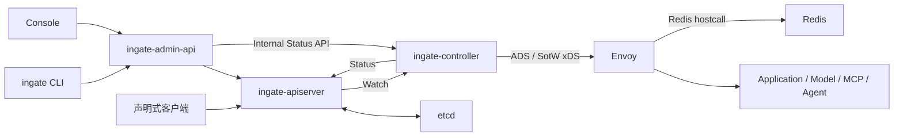
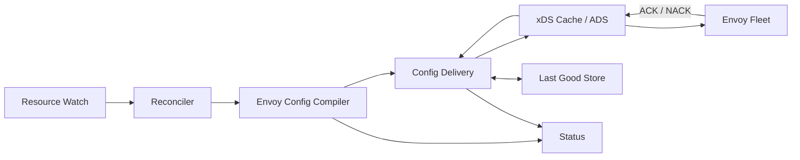
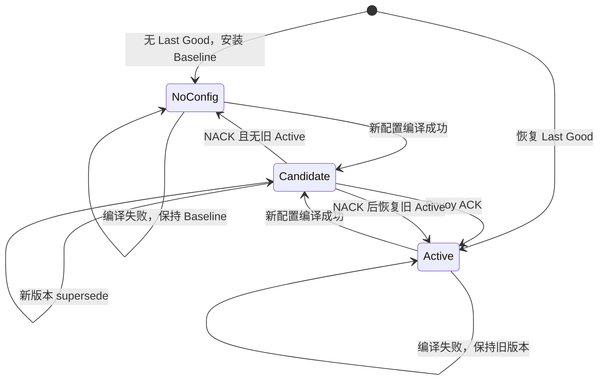

# Ingate 简化架构设计

## 文档状态

本文是 Ingate 当前总体架构的生效设计，取代以下文档中的长期架构结论：

- `2026-04-28-control-plane-core-mvp-design.md` 中的 Logical IR、Target、Translator 和 RuntimeSnapshot 架构
- `2026-07-14-higress-envoy-standalone-ratelimit-design.md` 中依赖 RedisStore、xDS target、RuntimeSnapshot 和独立 ingate-xds 的部分

旧文档仍保留为历史设计和实现依据，其中已经验证的 Envoy 二进制、Redis 扩展 ABI、限流算法及 E2E 要求继续有效，除非与本文冲突。

## 背景

Ingate 已经完成了从声明式资源到 Envoy 配置的第一条编译链路，但当前架构为未来可能存在的多运行时 target 提前引入了较多抽象：

```text
Resource
  -> Compiler
  -> Logical IR
  -> Target Translator
  -> RuntimeSnapshot
  -> ingate-xds
  -> Envoy
```

实际产品方向已经明确：

- Envoy 是 Ingate 的数据平面，不再为 Kong、Nginx 等假设设计 target 抽象
- 第一版官方 Envoy 二进制从 Higress 发行版取得，但在 Ingate 中只作为带有 Redis 扩展 ABI 的 Envoy 使用
- Ingate 的最终方向是 API 网关和 AI 网关，近期先建立稳定、直接的 Envoy 控制与治理链路
- 一套 Ingate 只管理一个环境和一个配置域中的同构 Envoy 实例

因此当前重点不是继续扩展通用运行时框架，而是删除没有真实使用场景的抽象，形成可以持续演进到 AI 网关的直接架构。

## 核心决策

### 一套 Ingate 的边界

一套 Ingate 表示：

```text
一个环境
= 一个配置域
= 一组配置完全相同的 Envoy 实例
```

生产、测试、不同 Region 或需要强隔离的租户分别部署独立 Ingate。

一套 Ingate 可以声明多个逻辑 Gateway。所有 Gateway 共同编译成一份 Envoy 配置，由 Host、SNI、Path、Method 和 Header 等匹配条件区分流量。

本设计不支持：

- 同一控制面向不同 Envoy 节点下发不同配置
- 按 RuntimeGroup、机房或租户选择不同配置
- 一个 Ingate 内存在多个相互隔离的配置域

### Envoy 是唯一数据平面

控制面直接生成 Envoy 配置，不保留运行时 target 插件体系。

新的主链路是：

```text
Gateway / Route / Upstream / Policy
  -> Envoy Config Compiler
  -> Config Delivery
  -> go-control-plane Snapshot Cache
  -> Envoy
```

Higress 只作为 Envoy 二进制来源。Ingate 生产代码不使用 Higress 产品模型、wrapper、高层 SDK 或配置协议；Redis hostcall 被视为 Ingate Envoy 已具备的底层扩展 ABI。

### 保留声明式资源 API

声明式资源 API 是 Ingate 的核心产品能力，继续保留 generic apiserver 和 etcd：

- `apiVersion / kind / metadata / spec / status`
- resourceVersion、generation 和 watch
- generated clients、informers 和 status 子资源
- Admin API 作为面向控制台的 DTO 和用例适配层

第一阶段不承诺完整 Kubernetes 兼容，不实现 Server-Side Apply、managedFields、Admission Webhook 或 Kubernetes RBAC。

### 删除提前设计的运行时抽象

以下抽象从产品 API 和长期架构中删除：

- RuntimeGroup 和 Gateway.RuntimeGroupRef
- RuntimeSnapshot API 资源
- Target、Translator、Registry 和 debug target
- 独立公开的 Logical IR package
- 独立 `ingate-xds` 二进制和进程

Envoy compiler 内部可以使用未导出的临时结构帮助组织代码，但这些结构不是跨 package、跨服务或用户可见的稳定协议。

## 系统组件



### ingate

CLI 和本地调试入口，通过 Admin API 或声明式 API 执行操作，不拥有独立业务状态。

### ingate-admin-api

面向控制台的产品 API：

- 请求绑定和产品 DTO
- displayName 唯一性等依赖系统状态的用例校验
- 跨资源操作和页面聚合
- 将资源状态转换为面向用户的错误和运行信息

Admin API 不参与配置编译，不进入请求数据路径。

### ingate-apiserver

声明式资源的权威入口：

- 持久化期望状态
- 执行资源自身能够判断的结构和字段校验
- 提供 watch、版本冲突和 status 子资源

跨资源引用、Gateway 冲突和 Envoy 能力校验由 Controller 最终判断。

### ingate-controller

合并原 Controller 与 xDS 服务，在一个进程中完成：

- 资源 watch 和收敛触发
- 全配置域编译
- Candidate、Active 和 Last Good 生命周期管理
- xDS Snapshot Cache 和 ADS 服务
- ACK/NACK 处理
- 资源状态和全局运行状态

合并的是进程和配置生命周期，不是把所有代码放入一个 package。

Controller 同时提供仅供内部组件使用的只读 HTTP 接口：

- `GET /healthz`：进程存活
- `GET /readyz`：ADS 已监听并可以接受 Envoy 连接
- `GET /internal/v1/status`：Candidate、Active、Last Good、连接和 ACK/NACK 摘要

Admin API 通过短超时内部 client 查询该接口，再转换为控制台 DTO。状态接口不可用时不影响资源 CRUD，Admin API 返回“运行状态暂不可用”，不暴露内部连接错误。该端口默认只监听内部地址，不向用户网络暴露；第一阶段依赖部署网络隔离，服务间认证后续单独设计。

### Envoy

Ingate 的唯一数据平面，第一版二进制从官方 Higress gateway 镜像取得，承担：

- HTTP、HTTPS、gRPC、WebSocket 和 SSE 代理
- 路由、TLS、负载均衡、健康检查、超时和熔断
- 内置 Wasm 治理插件
- Redis 扩展 hostcall ABI

Ingate 不启动 Higress Pilot，不使用 Higress 产品资源，也不维护 Envoy fork。除镜像构建记录二进制来源外，运行配置、日志、package 和产品界面统一使用 Envoy 或 Ingate 命名。

### Envoy 扩展代码边界

现有插件继续使用标准 `github.com/proxy-wasm/proxy-wasm-go-sdk` 处理 Proxy-Wasm 生命周期和标准 hostcall，不整体切换到 Higress SDK fork。

Ingate 新增自己维护的最小 Redis ABI 包，例如：

```text
plugins/internal/redisabi
```

该包只封装 Envoy 已提供的最小 ABI：

- `proxy_redis_init`
- `proxy_redis_call`
- `proxy_on_redis_call_response`
- Redis call response buffer

生产 Go 代码不 import `github.com/higress-group/...`。RESP、callback 生命周期、context 恢复和错误分类均由 Ingate 自己的 runtime 代码管理。代码把这些 ABI 当作 Ingate Envoy 的扩展能力，不在上层传播 Higress 命名或类型。

Higress SDK 可以作为 ABI 行为的参考实现，但不是生产依赖。ABI 适配通过普通 Go 单元测试、Wasm 构建测试和真实 Envoy E2E 验证。

### etcd

控制面持久化组件：

- 保存声明式资源
- 保存 Controller 内部 Last Good Envoy 配置

声明式资源和内部配置使用不同存储前缀，Last Good 不注册为 API 资源。

### Redis

Redis 是 Ingate 自带的运行状态组件，与 etcd 一起随项目交付：

- etcd 保存控制面期望状态
- Redis 保存限流、Token 配额等请求路径共享状态

Redis 不是 Upstream，也不是用户资源。部署可以是同容器进程、独立容器、Pod 或外部进程，安装模板负责连接，不向产品用户提供 Redis 地址配置。

## Controller 内部模块



建议按真实职责组织 package：

```text
internal/controller/app
internal/controller/reconcile
internal/envoy/config
internal/envoy/delivery
internal/envoy/xds
internal/envoy/lastgood
internal/controller/status
```

目录可以在实施时根据现有代码做小幅调整，但模块依赖方向必须保持。

`app` 是唯一装配入口：它创建共享的 go-control-plane Snapshot Cache，再分别注入 Delivery 和 xDS Server。xDS package 接受事件回调函数并上报 typed event，不 import Delivery；Delivery 可以依赖 xDS event 类型和共享 cache，但 xDS 不反向依赖 Delivery，从而避免 Go package 循环引用。Last Good Store 作为外部存储边界注入 Delivery。

### Resource Watch 与 Reconciler

负责：

- 使用 generated informer 监听声明式资源
- 将短时间内的多个事件合并为一次全局收敛
- 从 informer cache 构造不可变 ResourceSet
- 调用 Compiler、Delivery 和 Status

不负责：

- 生成 Envoy protobuf
- 管理 ADS stream
- 直接读写内部 Last Good 数据

资源事件继续使用 workqueue。一个资源变化可以影响多个 Gateway，因此第一阶段采用全配置域编译，避免按 Gateway 快照合并产生同名资源冲突和旧配置优先问题。

Reconciler 使用唯一全局 queue key。Gateway、Route、Upstream、Policy 和 PolicyBinding 的任意 spec 变化都只触发该 key，自然合并重复事件。status-only 更新必须在事件入口过滤，旧的 per-Gateway queue、依赖索引和 RuntimeSnapshot 删除路径全部移除。

### Envoy Config Compiler

Compiler 是纯编译模块：

```text
ResourceSet -> CompileResult
```

`CompileResult` 包含完整 Envoy Config 和结构化 Diagnostics。Diagnostic severity 只有 `Error` 与 `Warning`：

- 任意 `Error` 都阻止整个配置域发布 Candidate
- `Warning` 不阻止发布
- 禁用资源按用户语义排除，不属于“忽略无效资源”
- 启用资源存在错误时不能生成部分配置继续发布

负责：

- 构建资源索引和解析引用
- 校验 Listener、Route、Upstream 和 Policy 冲突
- 对所有启用资源执行确定性校验
- 生成 LDS、RDS、CDS、EDS 和内置 Wasm 配置所需的结构
- 返回包含 kind、ID、reason 和 message 的结构化诊断

不负责：

- watch、重试和状态写入
- etcd 持久化
- xDS stream、ACK/NACK
- Redis 网络调用

Compiler 可以复用小型内部结构降低单个函数复杂度，但不再输出 Logical IR 或 RuntimeSnapshot。

全局原子编译意味着一个无效资源会暂时阻塞其他新变更的发布，但不会影响当前 Active 流量。第一阶段接受这一取舍，以避免引入按 Gateway 的局部 Last Good 和复杂合并状态；后续只有出现真实的独立发布需求时才重新评估。

现有公开字段必须逐项处理，不能继续接受后静默丢弃：

- Upstream LoadBalancePolicy 和 Endpoint Weight 映射到 CDS/EDS
- Upstream HealthCheck 在实现前返回明确 `Unsupported`
- Header `Set` 与 `Add` 保持不同 Envoy 语义
- Route RetryOn 按用户配置生成，不使用固定条件覆盖
- HTTPS CertificateRef 在 TLS 实现前返回 `Unsupported`

### 多 Gateway 合并规则

多个 Gateway 不能各自生成 Listener 后再由 xDS 层临时去重。Compiler 负责生成规范化的全局 Envoy 配置：

- Listener 按 `(bindAddress, port, protocol)` 分组
- 第一阶段同一端口出现不同协议时返回 `Conflict`
- 多个 HTTP Gateway 可以共享一个 Listener 和一个 RDS RouteConfiguration
- Gateway hostname 在同一 Listener 内必须具有唯一所有权
- exact、wildcard 和 catch-all hostname 存在匹配重叠时返回 `Conflict`
- catch-all hostname 在同一 Listener 内最多出现一次
- 同一 virtual host 内完全相同的 Route match 返回 `Conflict`
- Route 使用稳定顺序：更长 PathPrefix 优先，其次是更多 Method/Header 约束，最后按 Route ID 和 Rule Name 排序
- Upstream cluster 以不可变 Upstream ID 作为全局身份，共享引用只生成一份 CDS/EDS 资源
- 所有 Envoy 资源名称从资源 ID 和规范化分组键确定生成，不能依赖 map 遍历或 informer 返回顺序

Route 的生效 Host 按 `(Gateway, Listener, Route)` 展开：

- `HostBinding.ListenerRefs` 必须引用当前 Gateway 中存在的 Listener；空列表返回 `InvalidSpec`
- 没有任何 HostBinding 引用某个 Listener 时，该 Listener 的所有权默认为 `*`
- HostBinding 的空 Hostname 规范化为 `*`
- Route 没有 Hostnames 时，继承所绑定 Listener 的全部有效 Host
- Route 有 Hostnames 时，每个 hostname 必须等于或属于该 Listener 的 Host 所有权；不满足时该 Route 不进入该 Listener，且没有任何 Listener 可挂载时返回 `Conflict`
- exact hostname 是对应 wildcard 的子集；两个 wildcard 有重叠时视为冲突
- 一个 Route 绑定多个 ParentRef 时，对每个 Gateway/Listener 独立展开和校验

这样可以在生成 virtual host 之前确定每条 Route 的 effective hostnames，不依赖 Envoy 对空域名、wildcard 和 filter chain 的隐式选择。

当前 Gateway HTTPS CertificateRef 尚未完整进入 Envoy 配置。在 TLS 语义实现前，Compiler 对 HTTPS Listener 返回明确 `Unsupported`，不能接受后静默生成明文 Listener。后续 TLS 设计需要补充 SNI filter chain、证书解析和重叠规则。

### Config Delivery

Delivery 是配置生命周期的唯一所有者，管理三个状态：

- Candidate：编译成功、准备或正在发布的新版本
- Active：已经被 Envoy 接受并由 xDS 当前服务的版本
- Last Good：已经持久化、可以在重启后恢复的 Active 版本

其他模块不能绕过 Delivery 直接替换 Snapshot Cache。

Delivery 内部串行处理 compile result 和 xDS event，确保 ACK、NACK、新 Candidate 和超时不会并发修改状态。

### xDS

xDS 模块使用 `go-control-plane` 标准 SotW Snapshot Cache 和 ADS server：

- 所有 Envoy 使用同一个固定 cache key
- Node ID 只用于连接、ACK/NACK 和日志观测
- 第一阶段只支持 SotW，不实现 Delta xDS
- callbacks 将连接、ACK 和 NACK 事件交给 Delivery
- xDS 模块不写资源状态，不访问 etcd

第一阶段固定 `github.com/envoyproxy/go-control-plane v0.14.0`，并把 `github.com/envoyproxy/go-control-plane/envoy` 对齐到其要求的 `v1.36.0`。依赖升级必须同时检查 root module、Envoy protobuf 子模块和实际 Envoy 二进制兼容性，不能让 Go MVS 隐式升级后未经验证。

callbacks 必须自己维护发送记录，不能依赖 go-control-plane 在 callback 之后执行的 stale nonce 检查：

- `OnStreamResponse` 在响应发送前记录 `(streamID, typeURL, nonce) -> version/nodeID`
- `OnStreamRequest` 根据发送记录和 ErrorDetail 分类 ACK/NACK
- 普通 ACK 可以投递到 Delivery 事件循环后返回
- 匹配当前 Candidate 的 NACK 必须使用带 reply 的同步事件，等待 Delivery 完成回滚后才能返回
- 如果同步回滚失败或超时，callback 返回错误关闭 stream，不能让标准 server 立即为坏 Candidate 重建 watch
- `OnStreamClosed` 使用本地 stream registry 清理状态，不能依赖可能为空的 node 参数

现有 Listener、Route、Cluster、Endpoint 和 Wasm builder 可以迁移复用；自研 ADS stream 状态机、nonce 管理和 RuntimeSnapshot watcher 删除。

### Last Good Store

Last Good Store 是唯一直接访问内部 etcd 前缀的模块，保存：

- schema version
- Envoy 配置版本和内容哈希
- LDS、RDS、CDS、EDS 序列化数据
- 生成时间

Last Good 使用单 key 原子记录。写入前必须完成 protobuf 序列化、内容哈希和 Snapshot consistency 检查；恢复时校验 schema、hash、protobuf 解码和引用一致性。损坏或不兼容记录不得部分装入 Cache，应保留原记录用于排障、报告 degraded，并尝试从当前声明式资源重新编译。

它不是声明式资源：

- 不提供 CRUD API
- 不生成 client 或 informer
- 不展示在 Console
- 不参与用户资源 watch

### Status

Status 模块负责：

- 将 Compiler diagnostics 写回相关资源
- 维护最小 `Accepted` Condition
- 提供 Controller/Envoy 全局运行状态

第一阶段不实现逐资源 `ResolvedRefs`、`Programmed`，也不把每个资源 generation 精确映射到每种 xDS type 的 ACK。

`Accepted` Condition 必须包含：

- `ObservedGeneration`
- 稳定 reason，例如 `Accepted`、`InvalidSpec`、`ReferenceNotFound`、`Conflict`、`Unsupported`、`CompileFailed`
- 不暴露内部错误的 message
- `LastTransitionTime`

Status 只在 Condition 内容变化时调用 UpdateStatus，并处理 resourceVersion 冲突。确定性编译错误写回状态后必须 `Forget` 当前 workqueue item，等待新的 spec 事件，不能无限 rate-limit 重试。

## 配置发布与 Last Known Good



### 正常发布

1. Reconciler 从 informer cache 构造完整 ResourceSet
2. Compiler 生成新的 Envoy Config 和内容版本
3. Delivery 将版本设为唯一当前 Candidate，并发布到 Snapshot Cache
4. 新 Candidate 到来时直接 supersede 旧 Candidate；旧版本后续事件永远不能改变状态
5. xDS callbacks 按 `{candidateVersion, streamID, nodeID, typeURL, responseNonce}` 收集 ACK/NACK
6. required type 是 Active 与 Candidate 所用动态 type 的并集，再结合该 stream 的实际订阅和发送记录判断；LDS 始终需要
7. Candidate 删除某类资源时，该 type 仍使用 Candidate 版本发送空资源响应并等待 ACK，不能因为新资源列表为空而跳过删除确认
8. 同一 stream/node 完成全部 required type ACK 后，版本成为 Active
9. Delivery 将 Active 持久化为 Last Good
10. 其他 Envoy 的 ACK/NACK 继续反映到全局运行状态

使用至少一个实例完成 ACK 作为配置有效性判断，是因为一套 Ingate 的 Envoy 实例必须使用相同二进制和相同配置。第一阶段不引入 quorum、全实例阻塞发布或滚动版本兼容状态机。

所有 xDS 事件进入 Delivery 的单线程事件循环。只有 nonce 和版本都匹配当前 Candidate 的事件才参与终态判断；迟到 ACK/NACK、已 supersede 版本和未知 stream 事件只记录 Debug 日志。当前 Candidate 在 ACK 前收到匹配 NACK 时立即拒绝，完整 ACK 与 NACK 的先后顺序决定终态。

没有 Envoy 连接时 Candidate 可以被后续版本 supersede，但不能成为 Active 或覆盖 Last Good。存在连接但在默认 30 秒内未完整 ACK 时，Candidate 继续保留在 Cache，状态标记为 `WaitingForACK`，不自动覆盖 Last Good；新的资源变更仍可以 supersede 它。超时值属于 Controller 启动配置，不进入用户资源。

### 编译失败

- 不发布 Candidate
- 不修改 Active 和 Last Good
- 将相关资源标记为 `Accepted=False`
- Admin API 展示稳定的 reason 和 message

### NACK

- Candidate 在成为 Active 前收到 NACK 时，Delivery 必须在 xDS request callback 返回前恢复旧 Active 到 Snapshot Cache
- 不重复发送同一个已拒绝版本
- 保留 Last Good
- 记录 node ID、type URL、版本和稳定错误摘要

首次启动没有 Active 或 Last Good 时，Controller 预先安装一个经过 consistency 校验的空 Baseline Snapshot。Baseline 为 LDS、RDS、CDS、EDS 都设置非空 baseline version 和空资源列表，使已订阅 type 能收到明确的空配置。首个 Candidate NACK 后恢复 Baseline，进入 `NoConfig`，`configReady=false`，继续保持 ADS watch 等待新 Candidate；不能把 nil 当作旧 Active，也不能重新发送被拒版本。Baseline 不是用户配置，不写入 Last Good。

版本已经由一个同构实例完整 ACK 后，其他实例的 NACK 不自动回滚整个 fleet，而是将全局状态标记为 degraded，避免单个异常或旧版本 Envoy 影响所有实例。

固定 cache key 通过显式 NodeHash 实现。Node ID 必须在同一 Ingate 内稳定且唯一，否则拒绝连接并记录错误，避免不同 Envoy 的 ACK 状态互相覆盖。

### 启动恢复

1. Controller 先读取 Last Good
2. 有 Last Good 时先恢复 Snapshot Cache，再启动 ADS 服务
3. informer cache 同步完成后重新编译当前资源
4. 当前资源有效时正常发布新 Candidate
5. 当前资源无效时继续服务 Last Good

Controller readiness 不依赖 Envoy ACK，避免启动死锁：

- `/healthz` 只表示进程存活
- `/readyz` 表示内部存储初始化完成且 ADS 已监听，可以让 Envoy 启动和连接
- 系统状态中的 `configReady` 表示 Cache 中存在由当前 Compiler 成功生成的 Candidate 或 Active；空 Baseline 不计入
- `deliveryState` 区分 `NoConfig`、`WaitingForEnvoy`、`WaitingForACK`、`Active` 和 `Degraded`

没有 Last Good 且当前资源无法编译时，ADS 仍保持监听，`configReady=false` 并报告明确错误。

## 状态模型

每类声明式资源第一阶段只维护一个 Condition：

```text
Accepted=True
  当前 generation 已被控制面接受并可参与有效配置

Accepted=False
  当前 generation 存在字段、引用、冲突、不支持能力或编译错误
```

`Accepted` 不表示所有 Envoy 都已经应用配置。

全局运行状态通过 Admin API 的系统状态接口提供，不创建新的声明式资源，至少包含：

- candidateVersion
- activeVersion
- lastGoodVersion
- configReady
- deliveryState，例如 `WaitingForEnvoy`、`WaitingForACK`、`Active`、`Degraded`
- connectedEnvoys
- 当前版本 ACK/NACK 摘要
- lastNACK 的 node、type、时间和错误摘要

## Upstream 模型

应用服务、模型服务、MCP Server 和外部 Agent 都是网关可以访问的上游，因此继续使用统一 Upstream：

```text
Upstream.Type
  - application
  - model
  - mcp
  - agent
```

`type` 只表达产品和业务分类，不隐式决定通信协议。

Upstream 后续增加独立的 `protocol` 语义，用于表达实际通信方式，例如普通 HTTP、gRPC、OpenAI-compatible、MCP Streamable HTTP 或 A2A。Compiler 根据 protocol 生成执行配置，不根据 type 猜测协议。

Upstream 统一承载网络目标、TLS、负载均衡、健康检查和通用上游认证引用。只有出现真实领域行为时才增加 Model、MCP 或 Agent 专用资源，不提前为每种类型建立完整资源体系。

以下边界保持明确：

- HTTP、SSE 或 Streamable HTTP 的 MCP Server 可以直接代理
- stdio MCP 需要独立桥接，不属于 Envoy 直接代理能力
- 外部 Agent 可以作为 Upstream 代理，但推理、记忆和 Tool 循环由 Agent 服务负责
- 一个公开模型映射到多个模型上游时，才有必要增加独立 Model 语义

## Redis 与内置治理插件

### Redis 是系统组件

Redis 与 etcd 一起由 Ingate 项目交付，但职责不同：

```text
ingate-apiserver -> etcd
Envoy / Wasm     -> Redis
```

产品模型删除 RedisStore：

- 删除 RedisStore API、generated client、Admin API 和 Console 页面
- RateLimitPolicy 不再包含 RedisStore 引用
- TokenQuotaPolicy 等未来策略也自动使用系统 Redis
- 用户不能配置 Redis 地址、模式、密码或连接池参数

RateLimitPolicy 同步收缩：

- 删除 `spec.global`
- `spec.mode=Global` 时自动使用系统 Redis
- key prefix 固定为 `ingate-rate-limit`，再按 Policy ID、Route ID 和规则名隔离
- Redis command timeout 使用系统默认值 50ms，不允许单条 Policy 覆盖
- `failurePolicy`、拒绝响应和 quota headers 保持用户可配置

部署拓扑可以变化，但由安装模板负责：

- all-in-one 可以在同一容器中启动独立 Redis 进程
- Docker Compose 可以使用独立 Redis 容器
- Kubernetes 可以使用独立 Redis Pod 或 Service

这些差异不进入声明式资源 API。

### 固定系统 Cluster

Envoy bootstrap 包含固定系统 Cluster：

```text
ingate-system-redis
```

安装模板为该 Cluster 渲染实际 Redis 地址。内置 Wasm 只引用固定名称，Controller、Compiler、Policy 和插件配置都不携带 Redis 地址。

`ingate-system-*` 是 Envoy bootstrap 系统资源的保留前缀，用户 Upstream 和动态 xDS 资源不能使用该前缀。系统 Redis Cluster 不进入 CDS Snapshot。

第一阶段只支持 Redis Standalone，使用官方 Redis，无认证、无 TLS，不支持 Sentinel 或 Cluster。这与当前 Envoy Redis 扩展 ABI 的验证范围一致。

### 删除 ingate-dataplane

内置限流插件通过 Ingate 自己的 Redis runtime adapter 调用 Envoy Redis 扩展 ABI：

```text
RateLimitPolicy
  -> Envoy Config Compiler
  -> 内置 ratelimit.wasm 配置
  -> Ingate Redis ABI adapter
  -> ingate-system-redis
```

删除：

- `cmd/ingate-dataplane`
- `internal/dataplane`
- `pkg/dataplane/ratelimit`
- 插件到 ingate-dataplane 的 HTTP/JSON 协议
- all-in-one 中 dataplane 进程和健康等待
- 只服务于 dataplane 的 go-redis 依赖

FixedWindow、SlidingWindow、TokenBucket、检查顺序、fail-open/fail-close 和 quota headers 语义保持不变。

RateLimit 插件配置 schema 升级为 v2：

- 删除 Listener 级 `redisStores` 和 `dataPlane`
- 删除 Policy 级 `global.redisRef`、`global.prefix` 和 `global.timeoutMillis`
- 插件内部使用固定 `ingate-system-redis` 和固定 50ms command timeout
- v2 解析器拒绝未知 schema version，不兼容读取 v1 后静默降级

v2 的顶层和嵌套结构固定为：

```json
{
  "schemaVersion": "v2",
  "routes": [
    {
      "gatewayName": "gateway-id",
      "routeName": "route-id",
      "bindings": [
        {
          "name": "binding-id",
          "target": {"kind": "Route", "name": "route-id", "ruleName": "rule-a"},
          "policies": [
            {
              "name": "policy-id",
              "mode": "Global",
              "rules": [],
              "response": {},
              "failurePolicy": "FailClose"
            }
          ]
        }
      ]
    }
  ]
}
```

`Policy` 不再有 `global` 字段；`Global` 只由 `mode=Global` 表示。`schemaVersion` 缺失、不是 `v2` 或出现未知字段都返回配置错误。RouteConfig 的 `gatewayName`、`routeName`、`bindings` 结构保持，插件不接收 Redis 地址、用户名、密码、TLS 或 cluster 配置。

Redis ABI 只在 `plugins/internal/redisabi` 中定义，固定为 Envoy 扩展的精确 ptr/len 签名：

```go
type HostStatus uint32
type RedisStatus int32
type BufferType uint32

//go:wasmimport env proxy_redis_init
func proxyRedisInit(
	clusterData *byte, clusterSize int32,
	usernameData *byte, usernameSize int32,
	passwordData *byte, passwordSize int32,
	timeoutMilliseconds uint32,
) HostStatus

//go:wasmimport env proxy_redis_call
func proxyRedisCall(
	clusterData *byte, clusterSize int32,
	queryData *byte, querySize int32,
	calloutID *uint32,
) HostStatus

//go:wasmimport env proxy_get_buffer_bytes
func proxyGetBufferBytes(
	bufferType BufferType,
	start int32,
	maxSize int32,
	returnBufferData unsafe.Pointer,
	returnBufferSize *int32,
) HostStatus

//go:wasmexport proxy_on_redis_call_response
func proxyOnRedisCallResponse(
	pluginContextID uint32,
	calloutID uint32,
	status int32,
	responseSize int32,
)
```

Redis response buffer 使用 `BufferType(9)`。三个 hostcall 的返回值是 `HostStatus(uint32)`，callback 的 Redis 执行状态是 `RedisStatus(int32)`，不能混用同一类型。

插件 Root Context 启动时只初始化一次固定 cluster。Dispatch registry 的 key 固定为 `(pluginContextID, calloutID)`，record 显式保存 plugin context 和 HTTP context，避免不同 plugin 的相同 callout ID 碰撞。HTTP context 创建时登记存活，`OnHttpStreamDone` 只移除/标记 liveness，不删除仍在飞行的 callout；callback 顺序固定为：设置始终有效的 plugin/root context，查找但暂不删除 callout 记录，根据显式 liveness 尝试切换 HTTP context，最后删除 callout。已销毁时稳定记录 `late_callback_ignored`，存活时在 callback 返回前复制 response buffer 并继续上层执行。

`proxywasm.SetEffectiveContext` 只改变 host context，不更新 SDK 私有的 `activeContextID`。因此自定义 Redis callback 的 buffer、Resume/Respond 和后续 Redis dispatch 必须调用 Ingate 自己的直接 hostcall，不能使用依赖 SDK callback registry 的异步 API。ABI status、buffer 类型、callback export 和 context 生命周期由绑定的 Envoy 镜像版本 E2E 验证；更换 Envoy 二进制必须重新运行 ABI smoke test。

## 插件执行边界

用户配置强类型 Policy 和 PolicyBinding，不配置插件文件、JSON、phase、priority 或 cluster name。

内置 Wasm 适合：

- 请求和响应的轻量检查与改写
- 模型名识别和改写
- Provider 认证注入的执行
- Token usage 提取
- RateLimit、AccessControl 和未来 TokenQuota
- 简单、确定性的内容规则

以下能力不应长期放入 Wasm：

- 一个请求触发多次模型或 Tool 调用
- Agent 记忆、会话、任务恢复和人工审批
- 大型 tokenizer 或 Provider SDK
- 长期用量存储和查询
- 动态成本、质量或语义模型路由

判断原则：一个入站请求对应一个出站请求、无状态且资源有界时使用 Envoy/Wasm；需要多次调用或跨请求状态时再引入独立 Runtime。

## AI 网关演进

本文不一次性设计完整 AI 资源体系。当前架构为 AI 网关保留以下直接演进路径：

1. Upstream 增加明确 protocol
2. 内置 AI Proxy Wasm 支持 OpenAI-compatible 单请求代理
3. 增加模型名改写、Provider 凭据注入、SSE 和 Token usage
4. 在出现多个模型上游映射需求后增加 Model 语义
5. 复杂跨 Provider 转换、动态模型路由或 Agent 执行出现后，再设计独立 AI/Agent Runtime

控制面始终不进入单次模型请求路径，分析和用量存储链路必须异步，失败不能阻塞代理。

## 部署

### all-in-one

第一阶段 all-in-one 包含：

```text
Console
ingate-admin-api
ingate-apiserver
ingate-controller
Envoy
etcd
Redis
```

不再包含：

```text
ingate-xds
ingate-dataplane
```

建议启动顺序：

1. etcd
2. Redis
3. ingate-apiserver
4. ingate-controller，内部启动 Last Good 恢复和 ADS
5. Envoy
6. ingate-admin-api 和 Console

启动脚本必须等待关键依赖健康，而不是仅启动进程后立即报告成功。启动 Envoy 前只等待 Controller `/readyz`，不能等待 `configReady` 或 Envoy ACK；Envoy 启动后再由整体 readiness 判断是否已经存在可用配置。

### 独立部署

独立容器或 Kubernetes 形态复用相同二进制和资源模型。Redis 地址、etcd 地址和 xDS 地址属于部署模板或进程启动配置，不进入用户声明式资源。

部署配置还必须提供 Controller Internal Status API 地址和 Admin API 查询超时；all-in-one 使用内部固定地址，独立部署通过受限 Service 暴露。整体 readiness 要同时检查 apiserver、Controller `/readyz` 和 Envoy admin readiness，但不等待某个业务 Gateway 存在。

## 错误处理

### 资源错误

- apiserver 拒绝字段格式、枚举、范围和资源自身约束错误
- Controller 处理引用不存在、跨资源冲突和 Envoy 能力不支持
- Admin API 可以提前检查，但 Controller 是声明式资源生效的最终裁决者

### 配置冲突

同名 Envoy 资源内容相同可以去重；同名内容不同必须导致 Candidate 编译失败，不能 first-wins。

### 删除和禁用

删除或禁用资源后重新编译整个配置域。编译成功后，新 Candidate 明确移除对应 Envoy 资源；不能因为 Last Good 机制永久保留已经删除的配置。

### Redis 故障

Redis 故障不影响 apiserver、Admin API、Controller 或普通代理流量。依赖 Redis 的策略按照自身 fail-open/fail-close 语义处理，并通过 Envoy/Wasm 日志和指标暴露故障；第一阶段不要求 Controller 主动探测 Redis。

### etcd 或 Last Good Store 故障

- apiserver 无法访问 etcd 时拒绝资源写入并报告不可用
- Last Good 持久化不可用时不覆盖已有 Last Good
- 已运行 Envoy 继续使用当前 Active 配置
- Controller 报告 degraded，并在存储恢复后重试持久化

## 迁移范围

实施需要删除或重构以下主要区域：

- Gateway.RuntimeGroupRef
- RuntimeGroup、RuntimeSnapshot 和 RedisStore API 类型及 registry
- 对应 generated client、informer、lister 和 conversion
- RuntimeGroup、RedisStore 的 Admin API 和 Console 功能
- `internal/core/ir`
- `internal/core/runtime`
- `internal/core/target`
- `internal/core/pipeline`
- Controller 写 RuntimeSnapshot 的逻辑
- xDS watch RuntimeSnapshot 和自研 ADS 状态机
- `cmd/ingate-xds` 与 `internal/xds/app`
- `cmd/ingate-dataplane` 及相关协议和部署逻辑

还必须覆盖以下依赖闭包：

- Gateway Admin DTO、Service 和 Console 中的 RuntimeGroup 字段与校验
- RateLimitPolicy Admin DTO、Service 和 Console 中的 `global`/Redis 选择逻辑
- `pkg/plugin/ratelimit`、`plugins/ratelimit/internal/dataplane` 和 `pkg/xredis`
- Resource Bundle、Kind、RedisMode 等常量
- generated OpenAPI、deepcopy、conversion、fake client、generic informer 和 lister
- Controller/xDS 的 `--target` 参数、default.env、bootstrap、Dockerfile、entrypoint 和 install.sh
- RuntimeSnapshot 的间接 Admin store 和资源路由
- 删除 go-redis，仅为标准 Snapshot Cache 增加完整 `github.com/envoyproxy/go-control-plane` 模块
- Controller Internal Status API 的 server、Admin client、DTO、service、handler、router、地址和超时配置
- Controller `/healthz`、`/readyz`、Envoy admin readiness 和 all-in-one 整体健康检查
- RateLimitPolicy v1 API、插件 v1 config、runner 和 Wasm callback 到 v2 的完整删除闭包
- schema bootstrap/reset 命令及 install.sh、首次安装、升级和 dev-reset 调用点

这是 Ingate Next 的新设计，当前不承诺对尚未稳定的 RuntimeGroup、RuntimeSnapshot、RedisStore 和旧 RateLimitPolicy API 提供兼容迁移层。

本次迁移采用开发期强制存储重置，不在同一个 `v1` 上原地读取旧对象：

1. 停止当前 Ingate
2. 删除现有 Ingate etcd 数据卷和旧 Last Good 数据
3. 使用新 API schema 启动服务
4. 重新创建声明式资源

Schema marker 协议固定为：

```text
key:   /ingate/internal/schema-version
value: 2
```

只有安装 bootstrap/reset 命令可以写 marker。该命令负责：

1. 停止 Ingate 服务
2. 删除 `/registry/gateway.ingate.io/` 和 `/ingate/internal/` 下的旧数据
3. 在同一次 reset 流程中写入值为 `2` 的 marker
4. 再启动 apiserver 和 Controller

apiserver 和 Controller 都只读取并校验 marker，不自动初始化：

- marker 为 `2`：允许启动
- marker 缺失：无论资源前缀是否为空都 fail-fast，并提示执行 bootstrap/reset
- marker 为旧版本或未知值：fail-fast
- 两个服务读取结果不一致：整体 readiness 失败

这样不会把“旧库缺 marker”误认为“新空库”。`install.sh` 的首次安装、升级和 `make dev-reset` 都必须调用同一个 bootstrap/reset 实现，并覆盖上述状态矩阵测试。

## 实施阶段

### 阶段一：模型和服务收缩

- 删除 RuntimeGroup、RuntimeSnapshot 和 RedisStore 产品资源
- 删除 Target、Translator、Logical IR 和 debug target
- 将 Envoy builder 收入新的 Envoy Config Compiler
- 保证现有 Gateway、Route、Upstream 和 Policy 行为有测试保护
- 执行开发期 etcd 数据重置并写入新 schema marker

### 阶段二：Controller 与 xDS 合并

- 接入标准 go-control-plane SotW Snapshot Cache
- 增加 Delivery、Last Good Store 和最小状态模型
- 删除独立 ingate-xds
- 验证多 Gateway 原子配置和 ACK/NACK 行为

### 阶段三：Envoy 与系统 Redis

- all-in-one 使用从官方 Higress 镜像取得的 Envoy 二进制
- bootstrap 增加 `ingate-system-redis`
- 先用最小真实插件验证 Ingate Redis ABI adapter
- 限流插件改用 Ingate Redis ABI adapter
- 删除 ingate-dataplane
- all-in-one 默认启动 Redis

### 阶段四：真实 E2E 和部署收口

- 创建 Gateway、Route、Upstream 和治理策略
- 验证配置编译、ADS ACK、真实代理和 Redis 限流
- 验证更新、删除、NACK、Controller 重启和 Last Good 恢复
- 验证 all-in-one 启动、健康检查和进程集合

### 阶段五：AI 网关纵向能力

- Upstream protocol
- OpenAI-compatible AI Proxy Wasm
- SSE、模型名改写、Provider 凭据和 Token usage

该阶段单独编写设计，不阻塞前四阶段实施。

## 测试策略

### 单元测试

- 资源引用、冲突和稳定排序
- 公开 API 字段不会被静默忽略
- Envoy Config Compiler 的 LDS、RDS、CDS、EDS 输出
- Delivery 的 Candidate、ACK、NACK 和回滚状态机
- Last Good 序列化、版本检查和恢复
- Redis RESP、Lua 算法和 fail-open/fail-close
- RateLimit v2 对缺失版本、v1、未知版本和未知字段的拒绝
- Redis ABI callout registry、有效 context 恢复和已销毁 context 忽略
- schema marker 缺失、正确、旧版、未知值和服务读取不一致
- xDS NACK callback 在返回前完成同步回滚
- Candidate 删除 RDS/CDS/EDS 时发送并 ACK 空资源版本

### 集成测试

- apiserver watch 触发全局收敛
- go-control-plane Snapshot Cache 与 callbacks
- 多 Gateway 合并和冲突拒绝
- 状态写回不会触发无休止 reconcile
- Internal Status API 超时和 Controller 不可用时不影响 Admin API 资源 CRUD
- 唯一全局 queue key 对连续事件正确去重
- package 依赖检查确保 xDS 不反向 import Delivery
- Controller `/readyz` 不依赖 Envoy ACK，all-in-one 启动无循环等待

### 真实 E2E

至少覆盖：

- all-in-one 启动并完成 readiness
- Envoy 连接 ADS 并 ACK 配置
- 普通 Upstream 代理成功
- 三种 Redis 限流算法
- Redis 不可用时的 fail-open 和 fail-close
- 更新 Route 后流量行为变化
- 删除或禁用资源后 Envoy 配置移除
- 非法更新不破坏 Active 配置
- Controller 和 Envoy 重启后恢复 Last Good
- 进程和镜像中不存在 ingate-xds、ingate-dataplane
- Candidate supersede 后忽略旧版本迟到 ACK/NACK
- Last Good 损坏或 schema 不兼容时拒绝部分恢复
- `ingate-system-*` 保留前缀不能被用户 Upstream 使用
- Redis callback 到达时请求 context 已销毁的安全处理

完成生产代码改动前必须运行：

```text
make test
make build
make plugins-test
make plugins-build
make console-build
make all-in-one-image
```

最终还必须运行真实 all-in-one smoke test 和 Envoy + Redis E2E；如果 Makefile 中尚无稳定目标，实施阶段应先增加明确目标再纳入验收。

## 非目标

第一阶段不实现：

- 多环境或多配置域控制
- RuntimeGroup 和节点级配置选择
- Delta xDS
- Kubernetes Operator
- Redis Sentinel、Cluster、认证或 TLS
- 用户自定义 Redis
- 完整 Secret 系统
- 多 Provider AI 协议转换
- Agent Runtime、MCP stdio bridge 或 Tool 执行循环
- 逐资源 Programmed 和精确 ACK generation 映射

## 验收标准

本架构迁移完成必须同时满足：

- 一套 Ingate 向所有 Envoy 实例发布同一份原子配置
- 多个 Gateway 可以共享同一 Envoy fleet
- Controller 内部模块边界符合本文职责
- 使用标准 go-control-plane SotW Snapshot Cache
- RuntimeGroup、RuntimeSnapshot、Target、Translator 和公开 Logical IR 已删除
- ingate-xds 和 ingate-dataplane 已删除
- RedisStore 已删除，Redis 作为项目内置系统组件运行
- Envoy 使用 Ingate 自己维护的 Redis ABI adapter 完成真实全局限流
- 无效资源或 NACK 不破坏 Last Good 配置
- Controller 重启能够从内部 etcd Last Good 恢复
- Admin API 能展示资源 Accepted 和全局运行状态
- 真实 Envoy + Redis E2E 通过
- `make test` 和 `make build` 通过
